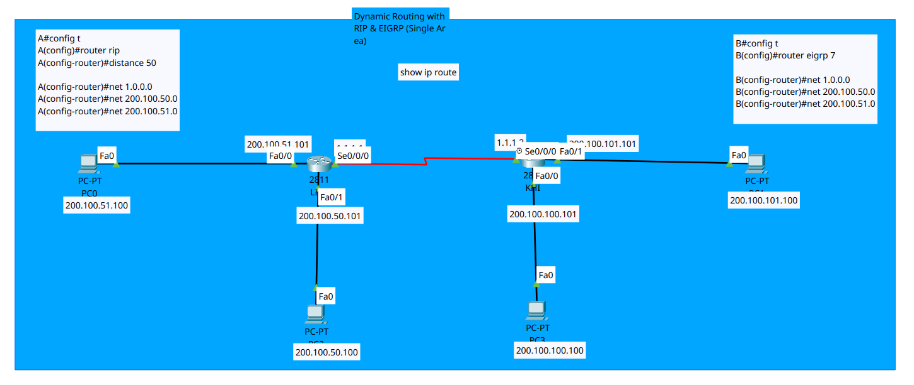

<div align="center">

# 🌐 Enterprise Dynamic Routing: EIGRP Autonomous System

[](https://cisco.com)
[](https://cisco.com)
[-brightgreen?style=for-the-badge)]()
[]()
[]()

<p align="center">
  <b>A dual-router enterprise branch interconnect running EIGRP across a Serial WAN link with multi-subnet LAN reachability and DUAL loop-free convergence.</b>
</p>

</div>

---

## 📌 Executive Summary

This lab implements an **Enhanced Interior Gateway Routing Protocol (EIGRP)** domain under **Autonomous System 7 (AS 7)** between two enterprise edge routers: **`LHR`** (Lahore Branch) and **`KHI`** (Karachi Hub). 

The primary objective is to configure classless subnet advertisement, verify dynamic neighbor adjacency over a Point-to-Point Serial WAN link, analyze EIGRP composite metric calculation, and validate full bidirectional reachability across all remote subnets.

---

## 🗺️ Network Topology & Architecture

<div align="center">
  
</div>

---

## 📊 IP Addressing Schema

| Device | Interface | IP Address | Subnet Mask | Default Gateway | Function / Role |
| :--- | :--- | :--- | :--- | :--- | :--- |
| **LHR** | `Fa0/0` | `200.100.51.101` | `255.255.255.0` | N/A | Branch LAN 1 Gateway |
| **LHR** | `Fa0/1` | `200.100.50.101` | `255.255.255.0` | N/A | Branch LAN 2 Gateway |
| **LHR** | `Se0/0/0` | `1.1.1.1` | `255.0.0.0` | N/A | WAN Uplink (to KHI) |
| **KHI** | `Fa0/0` | `200.100.100.101` | `255.255.255.0` | N/A | Hub LAN 3 Gateway |
| **KHI** | `Fa0/1` | `200.100.101.101` | `255.255.255.0` | N/A | Hub LAN 4 Gateway |
| **KHI** | `Se0/0/0` | `1.1.1.2` | `255.0.0.0` | N/A | WAN Uplink (DCE Clocked) |
| **PC0** | `NIC` | `200.100.51.100` | `255.255.255.0` | `200.100.51.101` | Engineering Host (LAN 1) |
| **PC2** | `NIC` | `200.100.50.100` | `255.255.255.0` | `200.100.50.101` | Server Host (LAN 2) |
| **PC3** | `NIC` | `200.100.100.100` | `255.255.255.0` | `200.100.100.101` | Management Host (LAN 3) |
| **PC1** | `NIC` | `200.100.101.100` | `255.255.255.0` | `200.100.101.101` | Operations Host (LAN 4) |

---

## 🎯 Technical Objectives & Protocol Mechanics

- [x] **Autonomous System Alignment:** Configure matching AS (`7`) to ensure reliable Hello/Update packet negotiation.
- [x] **WAN Link Provisioning:** Configure DCE clock rate (`2,000,000 bps`) on `KHI`'s `Se0/0/0` interface.
- [x] **Dynamic Subnet Advertisement:** Advertise local network segments into the EIGRP topology table.
- [x] **DUAL Algorithm Validation:** Verify loop-free path calculation and Feasible Distance (FD) population.

> [!NOTE]
> EIGRP uses **IP protocol number 88** and multicast address **`224.0.0.10`** for Hello packet exchanges and neighbor discovery. Both routers must share the identical **Autonomous System number** and **K-values** to establish adjacency.

---

## 📐 EIGRP Composite Metric Calculation

EIGRP calculates path metrics using a composite formula based on **Minimum Bandwidth** and **Cumulative Delay**:

$$\text{Metric} = 256 \times \left( \frac{10^7}{\text{Bandwidth}_{\text{min}}\text{ (kbps)}} + \frac{\sum \text{Delay}\text{ (}\mu\text{s)}}{10} \right)$$

*For this topology:*
* **WAN Serial Link (`Se0/0/0`):** $\text{BW} = 1544\text{ kbps}$, $\text{Delay} = 20,000\ \mu\text{s}$
* **LAN FastEthernet (`Fa0/0`):** $\text{BW} = 100,000\text{ kbps}$, $\text{Delay} = 100\ \mu\text{s}$
* **Calculated Metric:** Resulting in the installed EIGRP metric of **`2172416`** seen in the routing table.

---

## 🛠️ Cisco IOS Configuration Highlights

### 🔹 Router `LHR` (Lahore Branch)
```ios
hostname LHR
!
interface FastEthernet0/0
 description LAN_1_Engineering
 ip address 200.100.51.101 255.255.255.0
 no shutdown
!
interface FastEthernet0/1
 description LAN_2_Servers
 ip address 200.100.50.101 255.255.255.0
 no shutdown
!
interface Serial0/0/0
 description WAN_Uplink_to_KHI
 ip address 1.1.1.1 255.0.0.0
 no shutdown
!
router eigrp 7
 network 1.0.0.0
 network 200.100.50.0
 network 200.100.51.0
!
```

### 🔹 Router `KHI` (Karachi Hub)
```ios
hostname KHI
!
interface FastEthernet0/0
 description LAN_3_Management
 ip address 200.100.100.101 255.255.255.0
 no shutdown
!
interface FastEthernet0/1
 description LAN_4_Operations
 ip address 200.100.101.101 255.255.255.0
 no shutdown
!
interface Serial0/0/0
 description WAN_Uplink_to_LHR
 ip address 1.1.1.2 255.0.0.0
 clock rate 2000000
 no shutdown
!
router eigrp 7
 network 1.0.0.0
 network 200.100.100.0
 network 200.100.101.0
!
```

<details>
<summary><b>📄 Click to expand full raw device configurations</b></summary>

* See [`lhr-router-config.ios`](./lhr-router-config.ios) for complete running config.
* See [`khi-router-config.ios`](./khi-router-config.ios) for complete running config.

</details>

---

## 🔍 Verification & Routing Table Analysis

### 1. Verification of Learned Routes on `LHR`
```text
LHR# show ip route
Gateway of last resort is not set

     1.0.0.0/8 is variably subnetted, 2 subnets, 2 masks
C       1.0.0.0/8 is directly connected, Serial0/0/0
L       1.1.1.1/32 is directly connected, Serial0/0/0
     200.100.50.0/24 is variably subnetted, 2 subnets, 2 masks
C       200.100.50.0/24 is directly connected, FastEthernet0/1
L       200.100.50.101/32 is directly connected, FastEthernet0/1
     200.100.51.0/24 is variably subnetted, 2 subnets, 2 masks
C       200.100.51.0/24 is directly connected, FastEthernet0/0
L       200.100.51.101/32 is directly connected, FastEthernet0/0
D    200.100.100.0/24 [90/2172416] via 1.1.1.2, 01:51:21, Serial0/0/0
D    200.100.101.0/24 [90/2172416] via 1.1.1.2, 01:51:21, Serial0/0/0
```

> [!TIP]
> **Key CLI Output Decoding:**
> - **`D`**: Identifies routes discovered and maintained by DUAL (EIGRP).
> - **`90`**: Internal Administrative Distance (AD), establishing higher precedence over OSPF (110) and RIP (120).
> - **`2172416`**: Feasible Distance (metric calculated to destination).

---

### 2. End-to-End Ping Reachability Test Matrix

| Source Device | Destination Host | Target IP | Protocol | Loss Rate | Status |
| :--- | :--- | :--- | :--- | :--- | :--- |
| `PC0 (LAN 1)` | `PC3 (LAN 3)` | `200.100.100.100` | ICMP | `0%` | ✅ **Passed** |
| `PC0 (LAN 1)` | `PC1 (LAN 4)` | `200.100.101.100` | ICMP | `0%` | ✅ **Passed** |
| `PC2 (LAN 2)` | `PC3 (LAN 3)` | `200.100.100.100` | ICMP | `0%` | ✅ **Passed** |
| `PC2 (LAN 2)` | `PC1 (LAN 4)` | `200.100.101.100` | ICMP | `0%` | ✅ **Passed** |

---

## 📦 Repository Artifacts

* `dynamic-routing-eigrp.pkt` — Complete Cisco Packet Tracer simulation file.
* `topology.png` — High-definition topology diagram.
* `lhr-router-config.ios` — Cisco IOS startup configuration for Router LHR.
* `khi-router-config.ios` — Cisco IOS startup configuration for Router KHI.