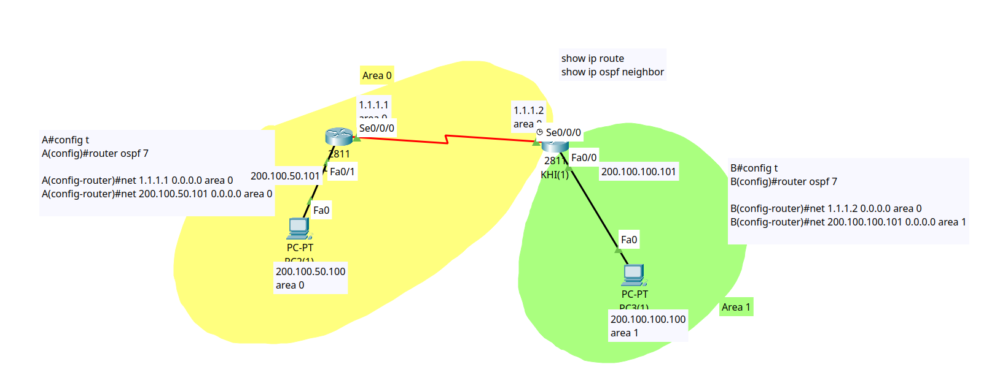

<div align="center">

# 🌐 Enterprise Dynamic Routing: Multi-Area OSPF & ABR Architecture

[](https://cisco.com)
[](https://cisco.com)
[]()
[]()
[]()

<p align="center">
  <b>A multi-area OSPF design demonstrating hierarchical routing, Area Border Router (ABR) functionality, and Type-3 Summary LSA generation (<code>O IA</code> routes) across Backbone Area 0 and Standard Area 1.</b>
</p>

</div>

---

## 📌 Executive Summary

In enterprise campus networks, flat single-area networks increase SPF calculation overhead and routing table bloat. This lab implements a **Hierarchical Multi-Area OSPF** topology connecting **Backbone Area 0** and **Standard Area 1** using Cisco 2811 routers running OSPF Process ID `7`.

The primary engineering objective is to configure **Router `KHI` as an Area Border Router (ABR)**, analyze Dijkstra SPF cost calculation across heterogeneous media (FastEthernet vs. Serial), and verify Inter-Area route advertisement (`O IA`) via Type-3 Summary LSAs.

---

## 🗺️ Network Topology & Architecture

<div align="center">
  
</div>

---

## 📊 IP Addressing & OSPF Area Schema

| Device | Interface | IP Address | Subnet Mask | Default Gateway | OSPF Area | Area Type / Description |
| :--- | :--- | :--- | :--- | :--- | :--- | :--- |
| **LHR** | `Fa0/1` | `200.100.50.101` | `255.255.255.0` | N/A | **Area 0** | Backbone LAN Gateway |
| **LHR** | `Se0/0/0` | `1.1.1.1` | `255.0.0.0` | N/A | **Area 0** | Backbone WAN Uplink (to KHI) |
| **KHI** | `Se0/0/0` | `1.1.1.2` | `255.0.0.0` | N/A | **Area 0** | Backbone WAN Uplink (DCE Provider) |
| **KHI** | `Fa0/0` | `200.100.100.101` | `255.255.255.0` | N/A | **Area 1** | Standard Branch LAN Gateway |
| **PC (Area 0)** | `NIC` | `200.100.50.100` | `255.255.255.0` | `200.100.50.101` | **Area 0** | Backbone Engineering Host |
| **PC (Area 1)** | `NIC` | `200.100.100.100` | `255.255.255.0` | `200.100.100.101` | **Area 1** | Branch Operations Host |

---

## 🎯 Technical Objectives & Protocol Mechanics

- [x] **Hierarchical OSPF Deployment:** Establish **Area 0** as the central transit backbone and attach **Area 1** directly to it.
- [x] **Area Border Router (ABR) Role:** Configure `KHI` with interfaces residing in both Area 0 and Area 1 to translate Type-1 intra-area LSAs into Type-3 summary LSAs.
- [x] **Point-to-Point WAN Adjacency:** Establish OSPF neighbor relationship over Serial interface `1.1.1.0/8` using multicast address `224.0.0.5`.
- [x] **Inter-Area Convergence:** Verify that remote subnets from Area 1 appear as `O IA` (Inter-Area) in Router `LHR`'s routing table.

> [!NOTE]
> OSPF is an open-standard link-state routing protocol operating directly over **IP Protocol 89**. In multi-area OSPF, non-backbone areas (Area 1) must maintain contiguous connectivity to Backbone Area 0 to prevent routing loops and ensure global reachability.

---

## 📐 OSPF Cost & Metric Calculation

OSPF uses interface **Cost** calculated via the Reference Bandwidth formula:

$$\text{Cost} = \frac{\text{Reference Bandwidth}}{\text{Interface Bandwidth}} = \frac{10^8 \text{ bps}}{\text{Bandwidth (bps)}}$$

*Path Cost Breakdown from `LHR` to Area 1 LAN (`200.100.100.0/24`):*
1. **Serial Link (`Se0/0/0` @ 1.544 Mbps):** $\text{Cost} = \frac{100,000,000}{1,544,000} \approx \mathbf{64}$
2. **FastEthernet Link (`Fa0/0` @ 100 Mbps):** $\text{Cost} = \frac{100,000,000}{100,000,000} = \mathbf{1}$
3. **Total Cumulative Cost:** $\mathbf{64 + 1 = 65}$

This matches the exact routing metric installed in the routing table: `[110/65]`.

---

## 🛠️ Cisco IOS Configuration Highlights

### 🔹 Router `LHR` (Internal Backbone Router — Area 0)
```ios
hostname LHR
!
interface FastEthernet0/1
 description Backbone_LAN_Segment
 ip address 200.100.50.101 255.255.255.0
 no shutdown
!
interface Serial0/0/0
 description WAN_Backbone_Link_to_KHI
 ip address 1.1.1.1 255.0.0.0
 no shutdown
!
router ospf 7
 log-adjacency-changes
 network 1.1.1.1 0.0.0.0 area 0
 network 200.100.50.0 0.0.0.255 area 0
!
```

### 🔹 Router `KHI` (Area Border Router — ABR)
```ios
hostname KHI
!
interface FastEthernet0/0
 description Branch_Area1_LAN
 ip address 200.100.100.101 255.255.255.0
 no shutdown
!
interface Serial0/0/0
 description WAN_Backbone_Link_to_LHR
 ip address 1.1.1.2 255.0.0.0
 clock rate 2000000
 no shutdown
!
router ospf 7
 log-adjacency-changes
 network 1.1.1.2 0.0.0.0 area 0
 network 200.100.100.0 0.0.0.255 area 1
!
```

<details>
<summary><b>📄 Click to expand full raw device configurations</b></summary>

* See [`lhr-area0-config.ios`](./lhr-area0-config.ios) for complete running config.
* See [`khi-abr-config.ios`](./khi-abr-config.ios) for complete running config.

</details>

---

## 🔍 Verification & Routing Table Analysis

### 1. Routing Table on Router `LHR` (Area 0)
```text
LHR# show ip route
Gateway of last resort is not set

     1.0.0.0/8 is variably subnetted, 2 subnets, 2 masks
C       1.0.0.0/8 is directly connected, Serial0/0/0
L       1.1.1.1/32 is directly connected, Serial0/0/0
     200.100.50.0/24 is variably subnetted, 2 subnets, 2 masks
C       200.100.50.0/24 is directly connected, FastEthernet0/1
L       200.100.50.101/32 is directly connected, FastEthernet0/1
O IA 200.100.100.0/24 [110/65] via 1.1.1.2, 00:01:18, Serial0/0/0
```

> [!TIP]
> **Key CLI Output Decoding:**
> - **`O IA`**: OSPF Inter-Area route (generated via Type-3 Summary LSA from ABR `KHI`).
> - **`110`**: Administrative Distance for OSPF.
> - **`65`**: Total path metric ($64 \text{ Serial Cost} + 1 \text{ FastEthernet Cost}$).

---

### 2. Routing Table on Router `KHI` (ABR)
```text
KHI# show ip route
Gateway of last resort is not set

     1.0.0.0/8 is variably subnetted, 2 subnets, 2 masks
C       1.0.0.0/8 is directly connected, Serial0/0/0
L       1.1.1.2/32 is directly connected, Serial0/0/0
O    200.100.50.0/24 [110/65] via 1.1.1.1, 00:02:03, Serial0/0/0
     200.100.100.0/24 is variably subnetted, 2 subnets, 2 masks
C       200.100.100.0/24 is directly connected, FastEthernet0/0
L       200.100.100.101/32 is directly connected, FastEthernet0/0
```

---

### 3. End-to-End Ping Reachability Test Matrix

| Source Device | Destination Host | Target IP | Source Area | Destination Area | Loss Rate | Status |
| :--- | :--- | :--- | :--- | :--- | :--- | :--- |
| `PC (Area 0)` | `PC (Area 1)` | `200.100.100.100` | Area 0 | Area 1 | `0%` | ✅ **Passed** |
| `PC (Area 1)` | `PC (Area 0)` | `200.100.50.100` | Area 1 | Area 0 | `0%` | ✅ **Passed** |

---

## 📦 Repository Artifacts

* `dynamic-routing-multi-area-ospf.pkt` — Complete Cisco Packet Tracer simulation file.
* `topology.png` — High-definition topology diagram with Area boundaries.
* `lhr-area0-config.ios` — Cisco IOS running configuration for Router LHR.
* `khi-abr-config.ios` — Cisco IOS running configuration for Router KHI (ABR).
