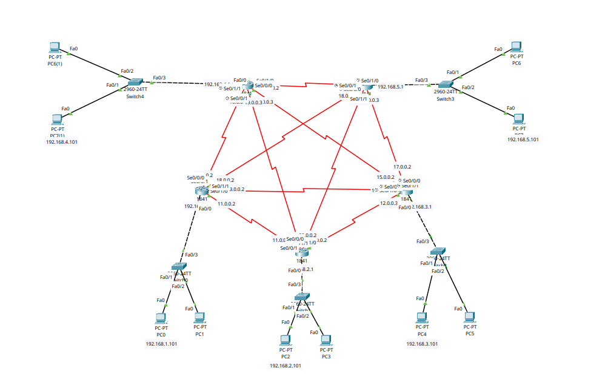

<div align="center">

# 🌐 Enterprise WAN Architecture: 5-Node Full-Mesh & ECMP Load Balancing

[](https://cisco.com)
[-blueviolet?style=for-the-badge)]()
[]()
[](https://cisco.com)
[]()

<p align="center">
  <b>A highly redundant 5-router full-mesh enterprise WAN interconnect (10 point-to-point Serial links) demonstrating dynamic route discovery, fault tolerance, and Equal-Cost Multi-Path (ECMP) load balancing.</b>
</p>

</div>

---

## 📌 Executive Summary

In mission-critical enterprise WAN topologies, single points of failure cannot be tolerated. This lab implements a **Complete Graph Full-Mesh WAN Topology ($K_5$)** comprising five interconnected core routers (`Router 0` through `Router 4`), five distribution switches, and ten user endpoints.

With ten redundant point-to-point Serial circuits connecting all five geographic nodes, the lab demonstrates how dynamic routing protocols calculate **Equal-Cost Multi-Path (ECMP)** routing entries to distribute traffic across parallel equal-cost paths.

---

## 🗺️ Network Topology & Architecture

<div align="center">
  
</div>

---

## 📊 IP Addressing Schema

### 🔹 Local Branch LAN Subnets
| Node | Gateway Interface | Gateway IP | Subnet Mask | Connected Switch | Attached Subnet | Branch ID |
| :--- | :--- | :--- | :--- | :--- | :--- | :--- |
| **Router 0** | `Fa0/0` | `192.168.1.1` | `255.255.255.0` | `Switch 0` | `192.168.1.0/24` | Branch 1 (Hosts PC0, PC1) |
| **Router 1** | `Fa0/0` | `192.168.2.1` | `255.255.255.0` | `Switch 1` | `192.168.2.0/24` | Branch 2 (Hosts PC2, PC3) |
| **Router 2** | `Fa0/0` | `192.168.3.1` | `255.255.255.0` | `Switch 2` | `192.168.3.0/24` | Branch 3 (Hosts PC4, PC5) |
| **Router 4** | `Fa0/0` | `192.168.4.1` | `255.255.255.0` | `Switch 4` | `192.168.4.0/24` | Branch 4 (Hosts PC6, PC7) |
| **Router 3** | `Fa0/0` | `192.168.5.1` | `255.255.255.0` | `Switch 3` | `192.168.5.0/24` | Branch 5 (Hosts PC6, PC8) |

### 🔹 WAN Point-to-Point Full-Mesh Interconnects (10 Circuits)
| Circuit Subnet | Endpoint A | Interface A | Endpoint B | Interface B | Clock Rate |
| :--- | :--- | :--- | :--- | :--- | :--- |
| `11.0.0.0/8` | `Router 0` | `Se0/1/0` (`11.0.0.2`) | `Router 1` | `Se0/1/0` (`11.0.0.3`) | 2,000,000 bps |
| `12.0.0.0/8` | `Router 1` | `Se0/1/1` (`12.0.0.2`) | `Router 2` | `Se0/1/0` (`12.0.0.3`) | 2,000,000 bps |
| `13.0.0.0/8` | `Router 0` | `Se0/1/1` (`13.0.0.2`) | `Router 2` | `Se0/1/1` (`13.0.0.3`) | 2,000,000 bps |
| `14.0.0.0/8` | `Router 4` | `Se0/1/0` (`14.0.0.2`) | `Router 3` | `Se0/1/0` (`14.0.0.3`) | 2,000,000 bps |
| `15.0.0.0/8` | `Router 2` | `Se0/0/0` (`15.0.0.2`) | `Router 4` | `Se0/0/0` (`15.0.0.3`) | Dynamic |
| `16.0.0.0/8` | `Router 0` | `Se0/0/0` (`16.0.0.2`) | `Router 4` | `Se0/1/1` (`16.0.0.3`) | 2,000,000 bps |
| `17.0.0.0/8` | `Router 2` | `Se0/0/1` (`17.0.0.2`) | `Router 3` | `Se0/1/1` (`17.0.0.3`) | 2,000,000 bps |
| `18.0.0.0/8` | `Router 0` | `Se0/0/1` (`18.0.0.2`) | `Router 3` | `Se0/0/1` (`18.0.0.3`) | 2,000,000 bps |
| `19.0.0.0/8` | `Router 1` | `Se0/0/1` (`19.0.0.2`) | `Router 4` | `Se0/0/1` (`19.0.0.3`) | 2,000,000 bps |
| `20.0.0.0/8` | `Router 1` | `Se0/0/0` (`20.0.0.2`) | `Router 3` | `Se0/0/0` (`20.0.0.3`) | 2,000,000 bps |

---

## 🎯 Technical Objectives & Full-Mesh Mechanics

- [x] **Full-Mesh WAN Topology:** Interconnect 5 core routers using 10 point-to-point WAN circuits using the complete mesh formula:
  
  $$\text{Links} = \frac{N(N - 1)}{2} = \frac{5(5 - 1)}{2} = 10\text{ Circuits}$$

- [x] **Equal-Cost Multi-Path (ECMP):** Validate dynamic multi-path installation in the Routing Information Base (RIB) when multiple equal-hop paths exist to the same destination.
- [x] **Zero Single Point of Failure:** Ensure uninterrupted reachability between any two branch subnets even if multiple WAN links suffer physical fiber cuts.

---

## 🔍 Routing Table & ECMP Verification

### 🔹 Evidence of Equal-Cost Multi-Path (ECMP) on `Router 4`
```text
Router# show ip route
Gateway of last resort is not set

R    11.0.0.0/8 [120/1] via 16.0.0.2, 00:00:11, Serial0/1/1
                [120/1] via 19.0.0.2, 00:00:17, Serial0/0/1
R    12.0.0.0/8 [120/1] via 19.0.0.2, 00:00:17, Serial0/0/1
                [120/1] via 15.0.0.2, 00:00:09, Serial0/0/0
R    13.0.0.0/8 [120/1] via 16.0.0.2, 00:00:11, Serial0/1/1
                [120/1] via 15.0.0.2, 00:00:09, Serial0/0/0
C    14.0.0.0/8 is directly connected, Serial0/1/0
C    15.0.0.0/8 is directly connected, Serial0/0/0
C    16.0.0.0/8 is directly connected, Serial0/1/1
R    17.0.0.0/8 [120/1] via 14.0.0.3, 00:00:13, Serial0/1/0
                [120/1] via 15.0.0.2, 00:00:09, Serial0/0/0
R    18.0.0.0/8 [120/1] via 16.0.0.2, 00:00:11, Serial0/1/1
                [120/1] via 14.0.0.3, 00:00:13, Serial0/1/0
C    19.0.0.0/8 is directly connected, Serial0/0/1
R    20.0.0.0/8 [120/1] via 14.0.0.3, 00:00:13, Serial0/1/0
                [120/1] via 19.0.0.2, 00:00:17, Serial0/0/1
R    192.168.1.0/24 [120/1] via 16.0.0.2, 00:00:11, Serial0/1/1
R    192.168.2.0/24 [120/1] via 19.0.0.2, 00:00:17, Serial0/0/1
R    192.168.3.0/24 [120/1] via 15.0.0.2, 00:00:09, Serial0/0/0
C    192.168.4.0/24 is directly connected, FastEthernet0/0
R    192.168.5.0/24 [120/1] via 14.0.0.3, 00:00:13, Serial0/1/0
```

> [!TIP]
> **ECMP Load Balancing Breakdown:**
> Notice how subnet `11.0.0.0/8` has **two equal-cost next-hop entries** (`via 16.0.0.2` and `via 19.0.0.2`), both with metric `[120/1]`. The Cisco IOS CEF engine automatically distributes packets across both physical serial interfaces.

---

## 🛠️ Configuration Repository Structure

All five router running configurations are cleanly stored in the [`configs/`](./configs/) directory:

| Device | Role | Config Link |
| :--- | :--- | :--- |
| **Router 0** | Core WAN Node 0 | [`r0-router-config.ios`](./configs/r0-router-config.ios) |
| **Router 1** | Core WAN Node 1 | [`r1-router-config.ios`](./configs/r1-router-config.ios) |
| **Router 2** | Core WAN Node 2 | [`r2-router-config.ios`](./configs/r2-router-config.ios) |
| **Router 3** | Core WAN Node 3 | [`r3-router-config.ios`](./configs/r3-router-config.ios) |
| **Router 4** | Core WAN Node 4 | [`r4-router-config.ios`](./configs/r4-router-config.ios) |

---

## 📦 Repository Artifacts

* `multi-router-full-mesh-ecmp.pkt` — Cisco Packet Tracer 5-router full mesh lab file.
* `topology.png` — High-definition topology diagram of the full-mesh pentagram.
* `configs/` — Full running configurations for all 5 routers (`r0` to `r4`).