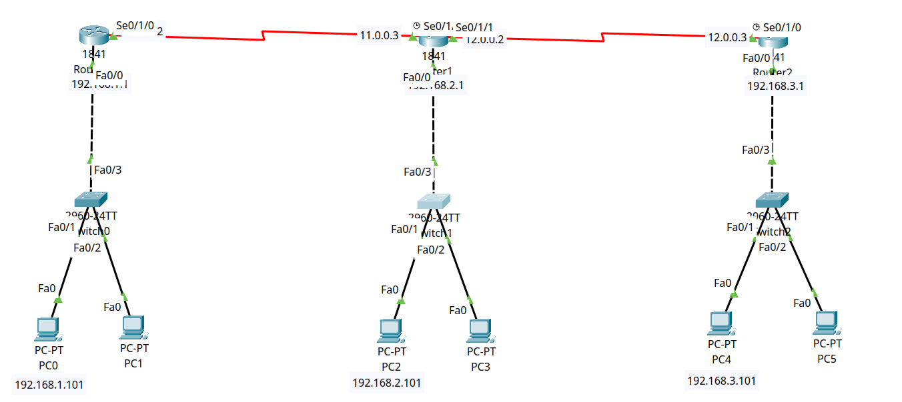

# 🌐 Enterprise Static Routing: Multi-Hop Transit WAN Architecture

## 1. Network Topology


---

## 2. IP Addressing Schema

| Device | Interface | IP Address | Subnet Mask | Default Gateway | Function / Description |
| :--- | :--- | :--- | :--- | :--- | :--- |
| **Router 0** | `Fa0/0` | `192.168.1.1` | `255.255.255.0` | N/A | Branch 1 LAN Gateway |
| **Router 0** | `Se0/1/0` | `11.0.0.2` | `255.0.0.0` | N/A | WAN Uplink to Router 1 |
| **Router 1** | `Fa0/0` | `192.168.2.1` | `255.255.255.0` | N/A | Central Hub LAN Gateway |
| **Router 1** | `Se0/1/0` | `11.0.0.3` | `255.0.0.0` | N/A | WAN Uplink to Router 0 (DCE) |
| **Router 1** | `Se0/1/1` | `12.0.0.2` | `255.0.0.0` | N/A | WAN Uplink to Router 2 |
| **Router 2** | `Fa0/0` | `192.168.3.1` | `255.255.255.0` | N/A | Branch 2 LAN Gateway |
| **Router 2** | `Se0/1/0` | `12.0.0.3` | `255.0.0.0` | N/A | WAN Uplink to Router 1 (DCE) |
| **PC0** | `NIC` | `192.168.1.101` | `255.255.255.0` | `192.168.1.1` | Branch 1 Host |
| **PC2** | `NIC` | `192.168.2.101` | `255.255.255.0` | `192.168.2.1` | Central Hub Host |
| **PC4** | `NIC` | `192.168.3.101` | `255.255.255.0` | `192.168.3.1` | Branch 2 Host |

---

## 3. Core Static Routing Concepts Demonstrated

### 1. Next-Hop IP vs. Exit Interface
Static routes in this lab use **Next-Hop IP addressing** (e.g., `ip route 192.168.3.0 255.255.255.0 11.0.0.3`). This allows recursive routing table lookups and prevents excessive ARP generation associated with interface-based static routes on broadcast media.

### 2. Multi-Hop Transit Forwarding
For `Router 0` to reach `Branch 2 (192.168.3.0/24)`, it has no direct physical connection. It forwards traffic to its next-hop neighbor `Router 1` (`11.0.0.3`), which performs a secondary lookup and forwards the packet out `Se0/1/1` to `Router 2`.

### 3. Symmetrical Return Paths
Routing is inherently unidirectional. Every router in the transit path (`Router 0`, `Router 1`, `Router 2`) is configured with explicit return routes to guarantee bidirectional ICMP and TCP sessions.

---

## 4. Cisco IOS Static Route Configurations

### 🔹 Router 0 (Branch 1)
```ios
hostname Router0
!
ip route 192.168.2.0 255.255.255.0 11.0.0.3
ip route 192.168.3.0 255.255.255.0 11.0.0.3
```

### 🔹 Router 1 (Central Transit Hub)
```ios
hostname Router1
!
ip route 192.168.1.0 255.255.255.0 11.0.0.2
ip route 192.168.3.0 255.255.255.0 12.0.0.3
```

### 🔹 Router 2 (Branch 2)
```ios
hostname Router2
!
ip route 192.168.1.0 255.255.255.0 12.0.0.2
ip route 192.168.2.0 255.255.255.0 12.0.0.2
```

---

## 5. Verification & Routing Tables

### 🔹 Router 0 Routing Table (`show ip route`)
```text
Router0# show ip route
Gateway of last resort is not set

C    11.0.0.0/8 is directly connected, Serial0/1/0
C    192.168.1.0/24 is directly connected, FastEthernet0/0
S    192.168.2.0/24 [1/0] via 11.0.0.3
S    192.168.3.0/24 [1/0] via 11.0.0.3
```

### 🔹 Router 1 Routing Table (`show ip route`)
```text
Router1# show ip route
Gateway of last resort is not set

C    11.0.0.0/8 is directly connected, Serial0/1/0
C    12.0.0.0/8 is directly connected, Serial0/1/1
S    192.168.1.0/24 [1/0] via 11.0.0.2
C    192.168.2.0/24 is directly connected, FastEthernet0/0
S    192.168.3.0/24 [1/0] via 12.0.0.3
```

### 🔹 Router 2 Routing Table (`show ip route`)
```text
Router2# show ip route
Gateway of last resort is not set

C    12.0.0.0/8 is directly connected, Serial0/1/0
S    192.168.1.0/24 [1/0] via 12.0.0.2
S    192.168.2.0/24 [1/0] via 12.0.0.2
C    192.168.3.0/24 is directly connected, FastEthernet0/0
```

> **CLI Decoding:**
> * `S`: Route learned statically.
> * `[1/0]`: Administrative Distance is **1** (higher preference than all dynamic routing protocols), metric is **0**.
> * `via X.X.X.X`: Next-hop IP forwarding address.

---

## 6. End-to-End Reachability Test Matrix

| Source Device | Destination Host | Target IP | Intermediate Hops | Loss Rate | Status |
| :--- | :--- | :--- | :--- | :--- | :--- |
| `PC0 (Branch 1)` | `PC2 (Hub)` | `192.168.2.101` | 1 (`Router 1`) | `0%` | ✅ **Passed** |
| `PC0 (Branch 1)` | `PC4 (Branch 2)` | `192.168.3.101` | 2 (`Router 1` → `Router 2`) | `0%` | ✅ **Passed** |
| `PC4 (Branch 2)` | `PC0 (Branch 1)` | `192.168.1.101` | 2 (`Router 1` → `Router 0`) | `0%` | ✅ **Passed** |

---

## 7. Included Artifacts
* `multi-hop-static-routing.pkt` — Cisco Packet Tracer simulation file.
* `topology.png` — Network topology diagram.
* `configs/` — Full Cisco IOS configurations for Router 0, Router 1, and Router 2.