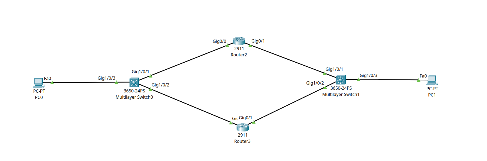

<div align="center">

# 🛡️ Enterprise High Availability: Dual-Segment HSRP Gateway Redundancy

[](https://cisco.com)
[](https://cisco.com)
[-brightgreen?style=for-the-badge)]()
[-orange?style=for-the-badge)]()
[]()

<p align="center">
  <b>Deploying dual-segment Hot Standby Router Protocol (HSRP v2 Groups 1 & 2) across core routers to eliminate single points of failure for both inside LAN clients and outside WAN server return paths.</b>
</p>

</div>

---

## 📌 Executive Summary

Standard single-sided HSRP deployments often fail during outages due to **asymmetrical return routing**—where outgoing packets reach their destination, but return replies are dropped by the failed gateway.

This lab configures a production-grade **Dual-Segment HSRP Architecture** across two Cisco 2911 routers (**`Router2`** and **`Router3`**):
* **HSRP Group 1 (LAN Gateway):** Provides Virtual IP **`10.1.1.1`** for internal LAN clients (`PC0`).
* **HSRP Group 2 (WAN Gateway):** Provides Virtual IP **`8.8.8.1`** for remote edge servers (`PC1`).

By synchronizing priority (`110` Active vs. `100` Standby) and preemption across both inside and outside segments, the network guarantees complete bidirectional failover with zero manual intervention.

---

## 🗺️ Network Topology & Architecture

<div align="center">
  
</div>

---

## 📊 IP Addressing & HSRP Schema

| Device | Interface | Physical IP | Subnet Mask | HSRP Group | HSRP Role | Priority | Virtual IP (VIP) |
| :--- | :--- | :--- | :--- | :--- | :--- | :--- | :--- |
| **Router2** | `Gig0/0` | `10.1.1.254` | `255.255.255.0` | **Group 1** | **Active Gateway** | `110` (Preempt) | `10.1.1.1` |
| **Router2** | `Gig0/1` | `8.8.8.251` | `255.255.255.0` | **Group 2** | **Active Gateway** | `110` (Preempt) | `8.8.8.1` |
| **Router3** | `Gig0/0` | `10.1.1.252` | `255.255.255.0` | **Group 1** | **Standby Gateway**| `100` (Preempt) | `10.1.1.1` |
| **Router3** | `Gig0/1` | `8.8.8.252` | `255.255.255.0` | **Group 2** | **Standby Gateway**| `100` (Preempt) | `8.8.8.1` |
| **PC0 (Client)** | `NIC` | `10.1.1.10` | `255.255.255.0` | N/A | LAN Host | N/A | Gateway: **`10.1.1.1`** |
| **PC1 (Server)** | `NIC` | `8.8.8.10` | `255.255.255.0` | N/A | WAN Server | N/A | Gateway: **`8.8.8.1`** |

---

## 🎯 Key High-Availability Concepts Explained

### 1. Active / Standby Gateway Election
* **Priority Value:** The router with the higher configured priority wins the election (`Router2` with priority `110` becomes Active; `Router3` with priority `100` becomes Standby).
* **Preemption (`standby preempt`):** Allows a recovered primary router (`Router2`) to immediately reclaim the Active role after a reboot or link recovery.

### 2. Eliminating Asymmetrical Return Path Failures
Routing is strictly unidirectional. If only the LAN interface runs HSRP, remote hosts will send return traffic to the failed physical WAN IP of the down router. Running **HSRP Group 2 on the WAN segment (`8.8.8.1`)** ensures return traffic dynamically follows the newly elected Active router (`Router3`).

---

## 🛠️ Cisco IOS Configurations

### 🔹 Router2 (Primary Active Gateway — LAN & WAN)
```ios
hostname Router2
!
interface GigabitEthernet0/0
 description LAN_Gateway_Segment
 ip address 10.1.1.254 255.255.255.0
 standby version 2
 standby 1 ip 10.1.1.1
 standby 1 priority 110
 standby 1 preempt
 no shutdown
!
interface GigabitEthernet0/1
 description WAN_Gateway_Segment
 ip address 8.8.8.251 255.255.255.0
 standby version 2
 standby 2 ip 8.8.8.1
 standby 2 priority 110
 standby 2 preempt
 no shutdown
!
```

### 🔹 Router3 (Backup Standby Gateway — LAN & WAN)
```ios
hostname Router3
!
interface GigabitEthernet0/0
 description LAN_Gateway_Segment
 ip address 10.1.1.252 255.255.255.0
 standby version 2
 standby 1 ip 10.1.1.1
 standby 1 priority 100
 standby 1 preempt
 no shutdown
!
interface GigabitEthernet0/1
 description WAN_Gateway_Segment
 ip address 8.8.8.252 255.255.255.0
 standby version 2
 standby 2 ip 8.8.8.1
 standby 2 priority 100
 standby 2 preempt
 no shutdown
!
```

---

## 🔍 Verification & Operational Proof

### 🔹 Router2 HSRP Summary (`show standby brief`)
```text
Router2# show standby brief
                     P indicates configured to preempt.
                     |
Interface   Grp  Pri P State    Active          Standby         Virtual IP
Gig0/0      1    110 P Active   local           10.1.1.252      10.1.1.1
Gig0/1      2    110 P Active   local           8.8.8.252       8.8.8.1
```

### 🔹 Router3 HSRP Summary (`show standby brief`)
```text
Router3# show standby brief
                     P indicates configured to preempt.
                     |
Interface   Grp  Pri P State    Active          Standby         Virtual IP
Gig0/0      1    100 P Standby  10.1.1.254      local           10.1.1.1
Gig0/1      2    100 P Standby  8.8.8.251       local           8.8.8.1
```

---

## 🧰 Helping, Verification & Troubleshooting Command Reference

| Command | Execution Level | Diagnostic Output & Operational Purpose |
| :--- | :--- | :--- |
| `show standby brief` | Privileged EXEC (`#`) | Displays summary line of group, priority, state (Active/Standby), active router IP, standby router IP, and virtual IP. |
| `show standby` | Privileged EXEC (`#`) | Detailed output displaying Hello/Hold timers, Virtual MAC address, preemption status, and failover state counters. |
| `show standby GigabitEthernet0/0` | Privileged EXEC (`#`) | Filters HSRP output exclusively for the specified interface. |
| `show ip arp` | Privileged EXEC (`#`) | Displays ARP cache to verify resolution of VIP `10.1.1.1` to Virtual MAC `0000.0c9f.f001`. |
| `debug standby events` | Privileged EXEC (`#`) | Real-time logging of state changes (`Speak` → `Standby` → `Active` / `Init`). |
| `debug standby packets` | Privileged EXEC (`#`) | Real-time packet tracing of transmitted/received multicast Hello packets on UDP port 1985. |

---

## ⚡ Real-World Failover Test Matrix

| Test Scenario | Action Performed | Routing Path | End-to-End Ping Result | Status |
| :--- | :--- | :--- | :--- | :--- |
| **Normal State** | Continuous ping from `PC0` to `8.8.8.10` | Forward & return traffic via `Router2` (Priority 110 Active) | `Reply from 8.8.8.10 (0% Loss)` | ✅ **Passed** |
| **Primary Link Cut** | `shutdown` on `Router2` interfaces | Both Group 1 & Group 2 fail over to `Router3` (Standby → Active) | `Reply from 8.8.8.10 (0% Loss)` | ✅ **Passed (Instant Failover)** |
| **Preemption Recovery**| `no shutdown` on `Router2` interfaces | `Router2` reclaims Active Gateway role on both LAN & WAN | `Reply from 8.8.8.10 (0% Loss)` | ✅ **Passed (Auto Reclaim)** |

---

## 📦 Included Artifacts

* `hsrp-gateway-redundancy.pkt` — Complete Cisco Packet Tracer simulation file.
* `topology.png` — Network topology diagram.
* `router2-active-config.ios` — Running configuration for Primary Gateway Router2.
* `router3-standby-config.ios` — Running configuration for Backup Gateway Router3.
