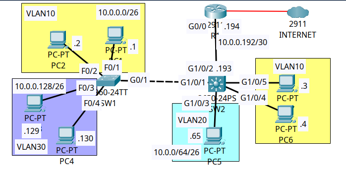

# 🏢 Multilayer Campus Switching: SVI Inter-VLAN Routing & Routed Uplinks


---

## 📌 Executive Summary

In legacy campus architectures, Inter-VLAN traffic relies on **Router-on-a-Stick (ROAS)**, where a single physical trunk link between an access switch and a router carries all segmented subnets. This introduces a single point of congestion and forces all intra-campus east-west traffic through a router CPU.

This production lab demonstrates the enterprise migration from ROAS to **Hardware-Accelerated Multilayer Switching**:
1. **ASIC Wire-Speed Inter-VLAN Routing:** Routing between departmental VLANs (VLAN 10, 20, 30) is offloaded directly to a distribution-layer **Cisco Catalyst 3650 Multilayer Switch** using **Switch Virtual Interfaces (SVIs)** and global `ip routing`.
2. **Layer 3 Routed Point-to-Point Uplinks:** The physical link between `SW2` and edge router `R1` is converted from an 802.1Q trunk into a native Layer 3 routed port (`no switchport`) with a dedicated `/30` subnet, eliminating STP blocking on campus core uplinks.
3. **Optimized Default Gateway Forwarding:** `SW2` acts as the first-hop default gateway for all campus access hosts while forwarding non-local Internet-bound egress traffic to `R1` via a static default route (`0.0.0.0/0 via 10.0.0.194`).

---

## 🗺️ Network Topology & Architecture

The campus topology consists of access layer switch `SW1`, distribution multilayer switch `SW2`, and perimeter edge router `R1` connecting upstream to external simulated public networks.



---

## 📊 IP Addressing & Parameter Schema

| Device | Interface | IP Address | Subnet Mask | Default Gateway | Function / Role |
| :--- | :--- | :--- | :--- | :--- | :--- |
| **SW2** | `Vlan10` | `10.0.0.62` | `255.255.255.192` (/26) | N/A | SVI Gateway for Engineering VLAN 10 |
| **SW2** | `Vlan20` | `10.0.0.126` | `255.255.255.192` (/26) | N/A | SVI Gateway for HR VLAN 20 |
| **SW2** | `Vlan30` | `10.0.0.190` | `255.255.255.192` (/26) | N/A | SVI Gateway for Management VLAN 30 |
| **SW2** | `Gig1/0/2` | `10.0.0.193` | `255.255.255.252` (/30) | N/A | Routed Point-to-Point Uplink to R1 |
| **R1** | `Gig0/0` | `10.0.0.194` | `255.255.255.252` (/30) | N/A | Routed Downlink to SW2 Distribution |
| **R1** | `Gig0/0/0` | `1.1.1.2` | `255.255.255.0` (/24) | `1.1.1.1` | WAN Public Internet Transit Interface |
| **SW1** | `Gig0/1` | Unassigned | Layer 2 Trunk | N/A | 802.1Q Uplink Trunk to SW2 (VLANs 10, 30) |
| **PC1 (SW1)** | `NIC` | `10.0.0.1` | `255.255.255.192` (/26) | `10.0.0.62` | Engineering Workstation (VLAN 10) |
| **PC2 (SW1)** | `NIC` | `10.0.0.2` | `255.255.255.192` (/26) | `10.0.0.62` | Engineering Workstation (VLAN 10) |
| **PC3 (SW2)** | `NIC` | `10.0.0.3` | `255.255.255.192` (/26) | `10.0.0.62` | Engineering Workstation (VLAN 10) |
| **PC4 (SW2)** | `NIC` | `10.0.0.4` | `255.255.255.192` (/26) | `10.0.0.62` | Engineering Workstation (VLAN 10) |
| **PC5 (SW2)** | `NIC` | `10.0.0.65` | `255.255.255.192` (/26) | `10.0.0.126` | HR Client Workstation (VLAN 20) |
| **PC6 (SW1)** | `NIC` | `10.0.0.129` | `255.255.255.192` (/26) | `10.0.0.190` | Management Endpoint (VLAN 30) |

---

## ⚙️ Key Cisco IOS Configuration Highlights

### 1. Enabling IP Routing & SVI Gateways (SW2 Catalyst 3650)
```cisco
SW2(config)# ip routing
SW2(config)# vlan 10,20,30
SW2(config)# exit

SW2(config)# interface Vlan10
SW2(config-if)# description SVI_Gateway_Engineering
SW2(config-if)# ip address 10.0.0.62 255.255.255.192
SW2(config-if)# no shutdown

SW2(config)# interface Vlan20
SW2(config-if)# description SVI_Gateway_HumanResources
SW2(config-if)# ip address 10.0.0.126 255.255.255.192
SW2(config-if)# no shutdown

SW2(config)# interface Vlan30
SW2(config-if)# description SVI_Gateway_Management
SW2(config-if)# ip address 10.0.0.190 255.255.255.192
SW2(config-if)# no shutdown
2. Converting Uplink Port to Layer 3 Routed Interface (SW2)
code
Cisco
SW2(config)# interface GigabitEthernet1/0/2
SW2(config-if)# description Routed_P2P_Uplink_to_R1
SW2(config-if)# no switchport
SW2(config-if)# ip address 10.0.0.193 255.255.255.252
SW2(config-if)# no shutdown
SW2(config)# ip route 0.0.0.0 0.0.0.0 10.0.0.194
3. Layer 2 Trunking & DTP Suppression (SW1 Catalyst 2960)
code
Cisco
SW1(config)# interface GigabitEthernet0/1
SW1(config-if)# description Trunk_Uplink_to_SW2_Distribution
SW1(config-if)# switchport mode trunk
SW1(config-if)# switchport trunk allowed vlan 10,30
SW1(config-if)# no shutdown
🔍 Verification & Operational Proof
1. Multilayer Switch Hardware Routing Table (SW2# show ip route)
SW2 directly maintains active CEF routing table entries for each SVI and points its default gateway of last resort to R1:
code
Text
SW2# show ip route
Gateway of last resort is 10.0.0.194 to network 0.0.0.0

     10.0.0.0/8 is variably subnetted, 8 subnets, 3 masks
C       10.0.0.0/26 is directly connected, Vlan10
L       10.0.0.62/32 is directly connected, Vlan10
C       10.0.0.64/26 is directly connected, Vlan20
L       10.0.0.126/32 is directly connected, Vlan20
C       10.0.0.128/26 is directly connected, Vlan30
L       10.0.0.190/32 is directly connected, Vlan30
C       10.0.0.192/30 is directly connected, GigabitEthernet1/0/2
L       10.0.0.193/32 is directly connected, GigabitEthernet1/0/2
S*   0.0.0.0/0 [1/0] via 10.0.0.194
2. SVI Interface Operational Status (SW2# show ip interface brief)
All Switch Virtual Interfaces reflect physical and line protocol up/up:
code
Text
SW2# show ip interface brief | include (Vlan|1/0/2)
GigabitEthernet1/0/2       10.0.0.193      YES manual up                    up
Vlan10                     10.0.0.62       YES manual up                    up
Vlan20                     10.0.0.126      YES manual up                    up
Vlan30                     10.0.0.190      YES manual up                    up
3. 802.1Q Trunk Validation (SW1# show interfaces trunk)
Validates that Gig0/1 is actively trunking and filtering only allowed departmental VLANs:
code
Text
SW1# show interfaces trunk
Port        Mode             Encapsulation  Status        Native vlan
Gig0/1      on               802.1q         trunking      1

Port        Vlans allowed on trunk
Gig0/1      10,30

Port        Vlans allowed and active in management domain
Gig0/1      10,30

Port        Vlans in spanning tree forwarding state and not pruned
Gig0/1      10,30
🛠️ NOC Troubleshooting & Diagnostic Cheat Sheet
Command	Diagnostic Purpose	Target Node
show ip route	Verifies hardware routing table, connected SVI subnets, and default route.	Multilayer Switches / Routers
show ip interface brief	Quick operational check verifying SVI interfaces are up/up.	All Layer 3 Devices
show interfaces status	Confirms port speed, duplex, access VLAN ID, or trunk status.	Catalyst Switches
show interfaces trunk	Validates active trunk encapsulation, native VLAN, and allowed VLAN lists.	Access & Distribution Switches
show vlan brief	Verifies that local VLANs exist in the switch database before SVI can come up.	All Switches
show mac address-table dynamic	Inspects learned MAC addresses mapped to their respective VLAN IDs and switchports.	Layer 2 & 3 Switches
🧪 Test Matrix & Verification Checklist
Test Case	Source Device	Target Destination	Expected Result	Status
TC-01: Intra-VLAN Reachability	PC1 (10.0.0.1)	PC2 (10.0.0.2)	Local Layer 2 switching across SW1	PASS ✅
TC-02: Cross-Switch Intra-VLAN	PC1 (10.0.0.1)	PC3 (10.0.0.3)	802.1Q trunk transit across Gig0/1 in VLAN 10	PASS ✅
TC-03: Inter-VLAN Routing (SVI)	PC1 (10.0.0.1)	PC5 (10.0.0.65 - HR)	Hardware SVI lookup on SW2 (Vlan10 to Vlan20)	PASS ✅
TC-04: Cross-VLAN Management	PC5 (10.0.0.65)	PC6 (10.0.0.129 - Mgmt)	Hardware SVI lookup on SW2 (Vlan20 to Vlan30)	PASS ✅
TC-05: Routed Uplink Forwarding	PC1 (10.0.0.1)	R1 G0/0 (10.0.0.194)	Routed across Gig1/0/2 P2P link via default route	PASS ✅
TC-06: External WAN Reachability	PC1 (10.0.0.1)	External (1.1.1.2)	Full end-to-end routing across campus distribution edge	PASS ✅
📦 Included Artifacts
README.md: Technical documentation, addressing schemas, and NOC operational runbook.
topology.png: Clean 16:9 network architecture diagram.
intervlan-routing-multilayer-svi.pkt: Complete Cisco Packet Tracer simulation file.
sw2-distribution-config.ios: Cisco Catalyst 3650 Multilayer Switch running configuration.
sw1-access-config.ios: Cisco Catalyst 2960 Layer 2 Switch running configuration.
r1-edge-config.ios: Cisco 2911 Edge Router running configuration.
