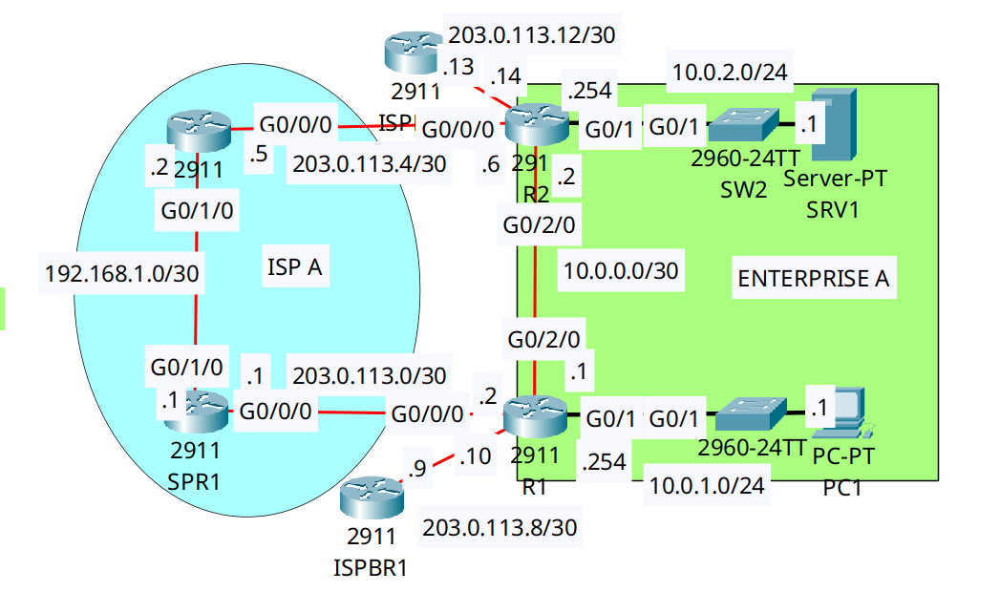

<div align="center">

# 🔄 Enterprise WAN Failover: Floating Static Routes & AD Tuning

[](https://cisco.com)
[](https://cisco.com)
[]()
[]()

<p align="center">
  <b>Ensuring high availability across enterprise branches by manipulating Administrative Distance (AD) to create backup floating static routes over secondary ISP circuits.</b>
</p>

</div>

---

## 📌 Executive Summary & Engineering Objective

In enterprise WAN architectures, branches often utilize high-speed internal point-to-point links (running dynamic routing protocols like OSPF) alongside secondary Internet connections via standard ISPs. If the primary internal link fails, traffic must automatically reroute over the public ISP without manual intervention.

This lab demonstrates **Administrative Distance (AD) Tuning**. By configuring a static route with an AD of `120`, it acts as a silent backup to the primary OSPF route (which has a default AD of `110`). 
* When the primary link is healthy, the routing table installs the OSPF route. 
* When the primary link fails, the OSPF route is withdrawn, and the floating static route automatically drops into the routing table, ensuring uninterrupted reachability.

---

## 🗺️ Network Topology & Architecture

<div align="center">
  
</div>

---

## 📊 IP Addressing & Routing Schema

| Router | Interface | Role / Zone | IP Address | Subnet Mask | Next Hop (Backup) |
| :--- | :--- | :--- | :--- | :--- | :--- |
| **R1** | `Gig0/1` | LAN (Enterprise A - PC1) | `10.0.1.254` | `255.255.255.0` | N/A |
| **R1** | `Gig0/2/0` | Primary Internal Link | `10.0.0.1` | `255.255.255.252` | `10.0.0.2` (OSPF) |
| **R1** | `Gig0/0/0` | ISP A (Backup WAN) | `203.0.113.2` | `255.255.255.252` | `203.0.113.1` (Static 120) |
| **R2** | `Gig0/1` | LAN (Enterprise A - SRV1) | `10.0.2.254` | `255.255.255.0` | N/A |
| **R2** | `Gig0/2/0` | Primary Internal Link | `10.0.0.2` | `255.255.255.252` | `10.0.0.1` (OSPF) |
| **R2** | `Gig0/0/0` | ISP A (Backup WAN) | `203.0.113.6` | `255.255.255.252` | `203.0.113.5` (Static 120) |

---

## 🛠️ Cisco IOS Configuration Highlights

### 🔹 R1: OSPF Baseline & Floating Static Route Backup
```ios
! 1. Establish the primary path via OSPF (Default AD = 110)
R1(config)# router ospf 1
R1(config-router)# network 10.0.0.0 0.0.0.3 area 0
R1(config-router)# network 10.0.1.0 0.0.0.255 area 0

! 2. Configure the Floating Static Route (AD = 120)
! This route remains dormant in the configuration until OSPF fails.
R1(config)# ip route 10.0.2.0 255.255.255.0 203.0.113.1 120
```

### 🔹 R2: Symmetrical Return Routing Backup
```ios
! The return path must also fail over correctly to avoid asymmetric routing blackholes.
R2(config)# ip route 10.0.1.0 255.255.255.0 203.0.113.5 120
```

---

## 🔍 Verification & Operational Proof (Failover Event)

The following output was captured **after simulating a failure on the primary internal link (Gig0/2/0)**. The router automatically withdrew the OSPF route and installed the backup static route.

### R1 Routing Table (Primary Link Failed)
```text
R1# show ip route
Gateway of last resort is 203.0.113.9 to network 0.0.0.0

     10.0.0.0/8 is variably subnetted, 3 subnets, 2 masks
C       10.0.1.0/24 is directly connected, GigabitEthernet0/1
L       10.0.1.254/32 is directly connected, GigabitEthernet0/1

! The Floating Static Route has successfully assumed control of forwarding:
S       10.0.2.0/24 [120/0] via 203.0.113.1

     203.0.113.0/24 is variably subnetted, 4 subnets, 2 masks
C       203.0.113.0/30 is directly connected, GigabitEthernet0/0/0
```
*Validation:* The bracket `[120/0]` proves that the standby route (Administrative Distance 120) is now actively routing traffic to the `10.0.2.0/24` subnet.

---

## 🧰 NOC Diagnostic & Troubleshooting Cheat Sheet

| Command | Execution Mode | Incident Response Application |
| :--- | :--- | :--- |
| `show ip route` | Privileged EXEC (`#`) | Verifies which path (OSPF `O` vs Static `S`) is currently injected into the active routing table. |
| `show ip route [subnet]` | Privileged EXEC (`#`) | Displays detailed metric, AD, and next-hop information for a specific destination network. |
| `traceroute [ip]` | Privileged EXEC (`#`) | Validates the actual hop-by-hop forwarding path to ensure traffic isn't silently blackholed or asymmetrically routed. |
| `show ip ospf neighbor` | Privileged EXEC (`#`) | Confirms if the primary dynamic routing adjacency has formed or failed. |

---

## ⚡ Incident Simulation & Failover Test Matrix

| Test Scenario | Link State | Expected AD | Active Protocol in Routing Table | Status |
| :--- | :--- | :--- | :--- | :--- |
| **Normal Operations** | R1-R2 P2P Link: `UP` | 110 | `O` (OSPF via `10.0.0.2`) | ✅ **Pass** |
| **Link Failure (Cut)** | R1-R2 P2P Link: `DOWN` | 120 | `S` (Static via `203.0.113.1`) | ✅ **Pass** |
| **Link Recovery** | R1-R2 P2P Link: `UP` | 110 | `O` (Reverts dynamically to OSPF) | ✅ **Pass** |

---

## 📦 Included Artifacts

* `floating-static-routes-wan-failover.pkt` — Packet Tracer failover simulation.
* `topology.png` — Network topology diagram.
* `r1-config.ios` — Edge Router 1 configurations containing AD manipulation.
* `r2-config.ios` — Edge Router 2 symmetrical return routing configurations.
