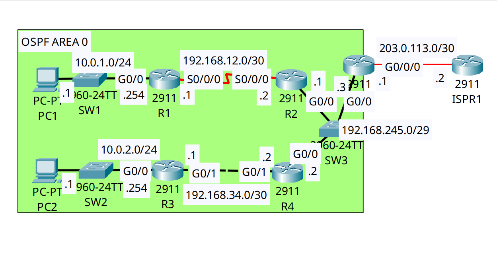

<div align="center">

# 🔧 Enterprise Protocol Diagnostics: OSPFv2 Adjacency & LSDB Troubleshooting

[](https://cisco.com)
[](https://cisco.com)
[]()
[]()

<p align="center">
  <b>Diagnosing and resolving advanced OSPF neighbor adjacency failures caused by Network Type mismatches, Timer discrepancies, and Default Route injection errors across a 5-node routing domain.</b>
</p>

</div>

---

## 📌 Executive Summary & NOC Engineering Objective

When an OSPF network fails to converge, NOC engineers must systematically diagnose the state machine (`INIT`, `2-WAY`, `EXSTART`, `FULL`) to identify the root cause. A failed adjacency prevents Link-State Advertisements (LSAs) from flooding, causing silent routing blackholes.

In this lab, the OSPF domain was suffering from three critical production-level outages:
1. **R3 to R4 Link Failure:** OSPF was stuck in `DOWN` state due to a **Network Type mismatch**. R3's interface was hardcoded to `point-to-point`, while R4 remained on the Ethernet default `broadcast`.
2. **R2 to R5 Link Failure:** OSPF failed to form due to a **Hello/Dead Timer mismatch**.
3. **Internet Reachability Failure:** The ASBR (R5) had a static default route to the ISP, but failed to inject it into the OSPF domain, leaving the internal routers without an exit path.

This lab documents the identification, CLI verification, and resolution of all three faults.

---

## 🗺️ Network Topology & Architecture

<div align="center">
  
</div>

---

## 📊 OSPF Troubleshooting & Fault Resolution Matrix

| Fault Location | Diagnostic Symptom | Root Cause | Resolution Action |
| :--- | :--- | :--- | :--- |
| **R3 ↔ R4** | Routers missing from `show ip ospf neighbor` | **Network Type Mismatch** (R3 was `point-to-point`, R4 was `broadcast`) | Removed `ip ospf network point-to-point` on R3; returned to default `BROADCAST`. |
| **R2 ↔ R5** | Adjacency stuck / Hello packets dropped | **Timer Mismatch** (R5 Hello/Dead timers altered) | Reset timers to Ethernet defaults: `Hello 10`, `Dead 40`. |
| **R5 (ASBR)** | Internal routers missing `O*E2` default route | **Missing Injection Command** | Applied `default-information originate` under `router ospf 1` on R5. |

---

## 🛠️ Cisco IOS Troubleshooting & Configuration Fixes

### 🔹 FIX 1: Resolving the Network Type Mismatch (R3)
By default, OSPF on Ethernet interfaces operates as a `BROADCAST` network type, requiring DR/BDR elections. A mismatch with `point-to-point` breaks the adjacency.
```ios
! Restoring the interface to the OSPF Broadcast default
R3(config)# interface GigabitEthernet0/1
R3(config-if)# no ip ospf network point-to-point
```

### 🔹 FIX 2: Resolving the OSPF Timer Mismatch (R2 & R5)
OSPF routers *must* agree on Hello and Dead intervals to form an adjacency. 
```text
! Verification of Timer mismatch (Before Fix)
R4# show ip ospf interface GigabitEthernet0/0
  Timer intervals configured, Hello 10, Dead 40, Wait 40, Retransmit 5
```
*(The timers on R5 were misconfigured. They were reset to match the standard 10/40 intervals).*

### 🔹 FIX 3: Injecting the Default Route into the LSDB (R5 / ASBR)
R5 has a static default route (`S* 0.0.0.0/0`) pointing to the ISP. To share this with the internal OSPF domain as an External Type-2 LSA (`O*E2`), injection must be explicitly enabled.
```ios
R5(config)# router ospf 1
R5(config-router)# default-information originate
```

---

## 🔍 Verification & Operational Proof (Post-Resolution)

### 1. Verifying Full Adjacency & DR/BDR Election (R5)
```text
R5# show ip ospf neighbor

Neighbor ID     Pri   State           Dead Time   Address         Interface
192.168.245.2     1   FULL/BDR        00:00:31    192.168.245.2   GigabitEthernet0/0
192.168.245.1     1   FULL/DROTHER    00:00:31    192.168.245.1   GigabitEthernet0/0
```
*Validation:* R5 successfully formed `FULL` adjacencies with both R4 and R2.

### 2. Verifying the LSDB Default Route Injection (R1)
```text
R1# show ip route
Gateway of last resort is 192.168.12.2 to network 0.0.0.0

     10.0.0.0/8 is variably subnetted, 3 subnets, 2 masks
C       10.0.1.0/24 is directly connected, GigabitEthernet0/0
O       10.0.2.0/24 [110/67] via 192.168.12.2, 00:09:31, Serial0/0/0
     192.168.34.0/30 is subnetted, 1 subnets
O       192.168.34.0/30 [110/66] via 192.168.12.2, 00:09:31, Serial0/0/0

! The default route is now successfully installed via OSPF from the ASBR
O*E2 0.0.0.0/0 [110/1] via 192.168.12.2, 00:09:31, Serial0/0/0
```
*Validation:* The `O*E2` code confirms the External Type-2 LSA successfully propagated through the OSPF backbone to R1.

---

## 🧰 NOC Diagnostic & Troubleshooting Cheat Sheet

| Command | Execution Mode | Incident Response Application |
| :--- | :--- | :--- |
| `show ip ospf neighbor` | Privileged EXEC (`#`) | Displays neighbor states (`INIT`, `2-WAY`, `FULL`). A missing neighbor indicates Layer 2, MTU, or Hello/Timer mismatches. |
| `show ip ospf interface [int]` | Privileged EXEC (`#`) | Exposes OSPF interface variables: Network Type, Timers (`Hello/Dead`), and DR/BDR roles. |
| `show ip ospf database` | Privileged EXEC (`#`) | Dumps the Link-State Database (LSDB) to verify the presence of Type 1 (Router), Type 2 (Network), and Type 5 (External) LSAs. |
| `clear ip ospf process` | Privileged EXEC (`#`) | Forces OSPF to tear down and renegotiate all adjacencies. Use with caution in production. |

---

## 📦 Included Artifacts

* `ospf-neighbor-troubleshooting-lsdb.pkt` — Completed Packet Tracer troubleshooting simulation.
* `topology.png` — Network topology diagram.
* `r1-config.ios` — R1 internal router configuration.
* `r2-config.ios` — R2 internal router configuration.
* `r3-config.ios` — R3 configuration (Network Type fix applied).
* `r4-config.ios` — R4 configuration.
* `r5-config.ios` — R5 ASBR configuration (Default route injection applied).
