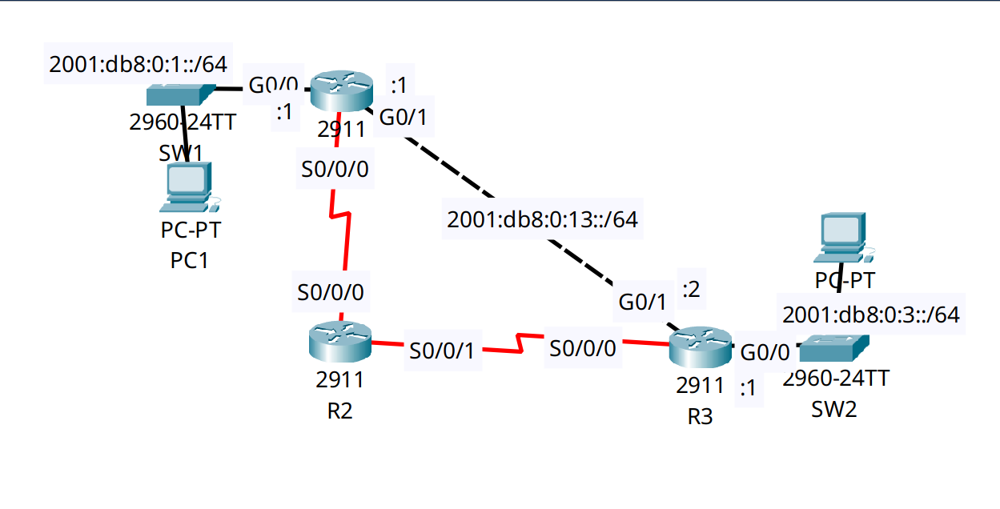

<div align="center">

# 🔄 IPv6 Enterprise Routing: SLAAC, Link-Local Next-Hops & Floating Failover

[](https://cisco.com)
[](https://cisco.com)
[]()
[]()

<p align="center">
  <b>Implementing a modern IPv6-only transit architecture utilizing Link-Local (FE80::) next-hop routing, SLAAC host autoconfiguration, and Administrative Distance failover.</b>
</p>

</div>

---

## 📌 Executive Summary & Engineering Objective

As IPv4 exhaustion accelerates, European enterprises and ISPs (especially in the Netherlands) heavily mandate dual-stack or IPv6-only architectures. A key differentiator in IPv6 is the separation of **Global Unicast Addresses (GUA)** used for data-plane traffic and **Link-Local Addresses (LLA)** used for control-plane protocols and routing next-hops.

This lab proves advanced IPv6 routing competence by:
1. **SLAAC Enablement:** Activating IPv6 routing globally so routers automatically send ICMPv6 Router Advertisements (RAs), allowing edge PCs to self-configure their IPs via EUI-64.
2. **Link-Local Transit Routing:** Configuring backup serial links without Global Unicast Addresses, relying entirely on `FE80::` Link-Local addresses for next-hop forwarding.
3. **IPv6 Floating Static Routes:** Implementing a fully-specified IPv6 static route (`[Exit-Interface] + [Link-Local Next-Hop]`) with a tuned Administrative Distance (`100`) to guarantee automatic WAN failover.

---

## 🗺️ Network Topology & Architecture

<div align="center">
  
</div>

---

## 📊 IPv6 Addressing & Routing Schema

| Router | Interface | Role / Zone | IPv6 Address (GUA / Link-Local) | Next-Hop Target |
| :--- | :--- | :--- | :--- | :--- |
| **R1** | `Gig0/0` | LAN 1 Gateway | `2001:DB8:0:1::1/64` | N/A (SLAAC enabled) |
| **R1** | `Gig0/1` | Primary WAN to R3 | `2001:DB8:0:13::1/64` | `2001:DB8:0:13::2` |
| **R1** | `Ser0/0/0` | Backup WAN to R2 | `FE80::202:4AFF:FE23:E201` (LLA Only) | `FE80::20B:BEFF:FED7:4901` |
| **R2** | `Ser0/0/0` | Transit from R1 | `FE80::20B:BEFF:FED7:4901` (LLA Only) | `FE80::202:4AFF:FE23:E201` |
| **R2** | `Ser0/0/1` | Transit to R3 | `FE80::20B:BEFF:FED7:4901` (LLA Only) | `FE80::290:2BFF:FECC:A101` |
| **R3** | `Gig0/0` | LAN 3 Gateway | `2001:DB8:0:3::1/64` | N/A (SLAAC enabled) |
| **R3** | `Gig0/1` | Primary WAN to R1 | `2001:DB8:0:13::2/64` | `2001:DB8:0:13::1` |
| **R3** | `Ser0/0/0` | Backup WAN to R2 | `FE80::290:2BFF:FECC:A101` (LLA Only) | `FE80::20B:BEFF:FED7:4901` |

---

## 🛠️ Cisco IOS Configuration Highlights

### 🔹 R1: Global Routing, SLAAC & Fully Specified Floating Route
```ios
! 1. Enable IPv6 globally (Required for SLAAC RA messages and IP routing)
R1(config)# ipv6 unicast-routing

! 2. Configure Backup WAN interface with Link-Local ONLY (No GUA)
R1(config)# interface Serial0/0/0
R1(config-if)# ipv6 enable

! 3. Configure Primary Route via Global Unicast Address (Default AD 1)
R1(config)# ipv6 route 2001:DB8:0:3::/64 2001:DB8:0:13::2

! 4. Configure Backup Floating Route (AD 100) using a Fully Specified Next-Hop
! (Requires BOTH the exit interface and the neighbor's Link-Local Address)
R1(config)# ipv6 route 2001:DB8:0:3::/64 Serial0/0/0 FE80::20B:BEFF:FED7:4901 100
```

### 🔹 R2: Pure Link-Local Transit Router
```ios
R2(config)# ipv6 unicast-routing
R2(config)# interface Serial0/0/0
R2(config-if)# ipv6 enable
R2(config)# interface Serial0/0/1
R2(config-if)# ipv6 enable

! R2 routes traffic between R1 and R3 using only Link-Local next-hops
R2(config)# ipv6 route 2001:DB8:0:1::/64 Serial0/0/0 FE80::202:4AFF:FE23:E201
R2(config)# ipv6 route 2001:DB8:0:3::/64 Serial0/0/1 FE80::290:2BFF:FECC:A101 100
```

---

## 🔍 Verification & Operational Proof

### 1. Validating Link-Local Address Assignments on R1
```text
R1# show ipv6 interface brief
GigabitEthernet0/0         [up/up]
    FE80::202:4AFF:FE23:E201
    2001:DB8:0:1::1
GigabitEthernet0/1         [up/up]
    FE80::202:4AFF:FE23:E202
    2001:DB8:0:13::1
Serial0/0/0                [up/up]
    FE80::202:4AFF:FE23:E201
```
*Validation:* `Serial0/0/0` is operational without a Global Unicast Address, conserving IP space on point-to-point transit links.

### 2. Validating the IPv6 Routing Table on R1 (Primary Path Active)
```text
R1# show ipv6 route
IPv6 Routing Table - 6 entries
Codes: C - Connected, L - Local, S - Static, R - RIP, B - BGP
       D - EIGRP, EX - EIGRP external

C   2001:DB8:0:1::/64 [0/0]
     via GigabitEthernet0/0, directly connected
S   2001:DB8:0:3::/64 [1/0]
     via 2001:DB8:0:13::2
C   2001:DB8:0:13::/64 [0/0]
     via GigabitEthernet0/1, directly connected
```
*Validation:* The static route `S` points to `2001:DB8:0:13::2` (via `Gig0/1`). The floating route (AD 100) via `Serial0/0/0` is correctly hidden in the background, waiting for a primary link failure.

---

## 🧰 NOC Diagnostic & Troubleshooting Cheat Sheet

| Diagnostic Command | Execution Mode | Purpose & Application |
| :--- | :--- | :--- |
| `show ipv6 interface brief` | Privileged EXEC (`#`) | Displays all GUAs and automatically generated `FE80::` Link-Local addresses. |
| `show ipv6 route` | Privileged EXEC (`#`) | Verifies active IPv6 routes. Ensure floating static routes are NOT visible while primary is UP. |
| `show ipv6 neighbors` | Privileged EXEC (`#`) | IPv6 equivalent of the ARP table. Uses NDP (Neighbor Discovery Protocol) to map GUAs to MAC addresses. |
| `ping ipv6 [address]` | Privileged EXEC (`#`) | Confirms end-to-end ICMPv6 reachability. |

---

## ⚡ Key Takeaway
**IPv6 architecture completely decouples addressing from routing.** Enterprise core and WAN links do not require routable Global Unicast Addresses; routing adjacent nodes securely via `FE80::` Link-Local addresses prevents transit links from being targeted by external internet traffic while aggressively conserving address space.

---

## 📦 Included Artifacts

* `ipv6-dual-stack-routing-slaac.pkt` — Packet Tracer simulation.
* `topology.png` — Network topology diagram.
* `r1-config.ios` — R1 Global, SLAAC, and Primary Edge configuration.
* `r2-config.ios` — R2 Link-Local Transit configuration.
* `r3-config.ios` — R3 Global, SLAAC, and Primary Edge configuration.
