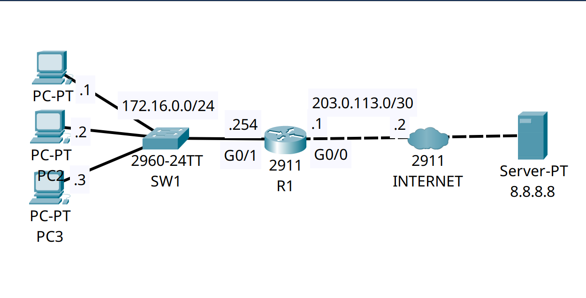

<div align="center">

# 🔄 Enterprise Edge Architecture: Dynamic PAT (NAT Overload)

[-00599C?style=for-the-badge&logo=cisco&logoColor=white)](https://cisco.com)
[](https://cisco.com)
[]()
[]()

<p align="center">
  <b>Conserving public IPv4 address space by multiplexing hundreds of internal enterprise hosts behind a single routable public IP address using Layer 4 source ports.</b>
</p>

</div>

---

## 📌 Executive Summary & Engineering Objective

As public IPv4 address space remains exhausted, enterprise networks cannot assign a unique public IP to every internal workstation. The standard architectural solution is deploying **Port Address Translation (PAT)**, also known as **NAT Overload**, at the WAN edge router. 

This lab demonstrates how to configure an edge router (R1) to translate traffic from a private internal subnet (`172.16.0.0/24`) into a single public-facing IP address (`203.0.113.1`). By tracking individual sessions using Layer 4 transport ports (TCP/UDP/ICMP), the router successfully maintains bidirectional communication for multiple internal hosts simultaneously over a single public uplink.

---

## 🗺️ Network Topology & Architecture

<div align="center">
  
</div>

---

## 📊 IP Addressing & NAT Boundary Schema

| Device / Host | Interface | NAT Zone Designation | IP Address | Subnet Mask | Route Type |
| :--- | :--- | :--- | :--- | :--- | :--- |
| **PC1** | `NIC` | Inside Local | `172.16.0.1` | `255.255.255.0` | Private (RFC 1918) |
| **R1 (Edge)**| `Gig0/1` | **Inside Interface** | `172.16.0.254` | `255.255.255.0` | Private Gateway |
| **R1 (Edge)**| `Gig0/0` | **Outside Interface** | `203.0.113.1` | `255.255.255.252` | Inside Global (Public) |
| **Server** | `NIC` | Outside Global | `8.8.8.8` | `255.255.255.0` | Public Internet |

---

## 🛠️ Cisco IOS Configuration Highlights

### 🔹 R1: Defining NAT Boundaries & ACL Identification
```ios
! 1. Define the internal (private) and external (public) interfaces
R1(config)# interface GigabitEthernet0/1
R1(config-if)# ip nat inside

R1(config)# interface GigabitEthernet0/0
R1(config-if)# ip nat outside

! 2. Identify the internal "interesting traffic" eligible for translation
R1(config)# access-list 1 permit 172.16.0.0 0.0.0.255
```

### 🔹 R1: Enabling PAT (NAT Overload)
```ios
! 3. Map the access-list to the external interface and append the 'overload' keyword
! Without 'overload', this would be Dynamic NAT (1-to-1) and would exhaust immediately.
R1(config)# ip nat inside source list 1 interface GigabitEthernet0/0 overload
```

---

## 🔍 Verification & Operational Proof (Layer 4 Multiplexing)

The following output was captured after initiating ICMP Echo Requests (pings) from internal host `PC1 (172.16.0.1)` to the external Internet Server `8.8.8.8`.

### R1 Translation Table (NAT Overload Active)
```text
R1# show ip nat translations
Pro  Inside global     Inside local       Outside local      Outside global
icmp 203.0.113.1:1     172.16.0.1:1       8.8.8.8:1          8.8.8.8:1
icmp 203.0.113.1:2     172.16.0.1:2       8.8.8.8:2          8.8.8.8:2
icmp 203.0.113.1:3     172.16.0.1:3       8.8.8.8:3          8.8.8.8:3
icmp 203.0.113.1:4     172.16.0.1:4       8.8.8.8:4          8.8.8.8:4
```
*Validation:* 
* **Inside local** (`172.16.0.1`) represents the actual private IP of PC1.
* **Inside global** (`203.0.113.1`) represents the public IP of R1's WAN interface.
* **Port multiplexing** is visible via the `:1`, `:2`, `:3`, `:4` suffixes. R1 modifies the ICMP sequence numbers (acting as ports) to track the return traffic for the private host.

---

## 🧰 NOC Diagnostic & Troubleshooting Cheat Sheet

| Command | Execution Mode | Incident Response Application |
| :--- | :--- | :--- |
| `show ip nat translations` | Privileged EXEC (`#`) | Verifies active session mapping. Crucial for identifying if an internal host is generating excessive sessions (e.g., malware or botnet activity). |
| `show ip nat statistics` | Privileged EXEC (`#`) | Displays global NAT hits, misses, and verifies which interfaces are designated as `inside` vs `outside`. |
| `clear ip nat translation *` | Privileged EXEC (`#`) | Flushes the dynamic NAT table. Used to force a reset of stalled translations or after applying new ACL rules. |
| `debug ip nat` | Privileged EXEC (`#`) | Real-time monitoring of address translation as packets cross the inside/outside boundary. |

---

## 📦 Included Artifacts

* `enterprise-edge-nat-pat-overload.pkt` — Packet Tracer enterprise edge simulation.
* `topology.png` — Network topology diagram.
* `r1-config.ios` — Edge Router configuration containing ACLs and PAT overload statements.
