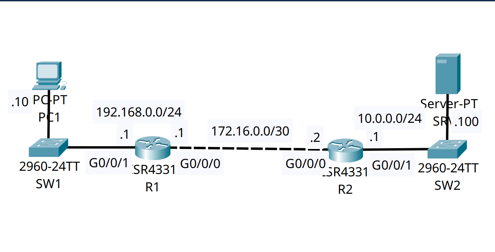

<div align="center">

# 🔄 Modular QoS CLI (MQC): Traffic Prioritization & DSCP Marking

[-00599C?style=for-the-badge&logo=cisco&logoColor=white)](https://cisco.com)
[](https://cisco.com)
[]()
[]()

<p align="center">
  <b>Ensuring application performance across congested WAN links by implementing Cisco's Modular QoS CLI (MQC) for deep packet inspection, DSCP marking, and Low Latency Queuing (LLQ).</b>
</p>

</div>

---

## 📌 Executive Summary & Engineering Objective

In enterprise networks, raw bandwidth alone cannot guarantee the performance of critical applications during network congestion. **Quality of Service (QoS)** must be applied to identify, mark, and prioritize traffic before it leaves the edge router.

This lab demonstrates the three-step **Modular QoS CLI (MQC)** architecture on a Cisco edge router:
1. **Classification (`class-map`):** Identifying traffic utilizing NBAR (Network Based Application Recognition) for HTTPS, HTTP, and ICMP protocols.
2. **Marking (`policy-map`):** Setting Differentiated Services Code Point (DSCP) values in the IP header to define the Per-Hop Behavior (PHB).
3. **Queuing & Scheduling (`service-policy`):** Allocating guaranteed bandwidth using **CBWFQ (Class-Based Weighted Fair Queuing)** and strict priority processing using **LLQ (Low Latency Queuing)** for critical flows.

---

## 🗺️ Network Topology & Architecture

<div align="center">
  
</div>

---

## 📊 QoS Classification, Marking & Queuing Schema

| Traffic Profile | MQC Class-Map | DSCP Marking | Per-Hop Behavior (PHB) | Queuing Strategy | Allocation |
| :--- | :--- | :--- | :--- | :--- | :--- |
| **HTTPS Traffic** | `HTTPS_MAP` | **AF31** | Assured Forwarding 31 (Low Drop) | **LLQ** (Strict Priority) | 10% |
| **HTTP Traffic** | `HTTP_MAP` | **AF32** | Assured Forwarding 32 (Med Drop) | **CBWFQ** (Bandwidth) | 10% |
| **ICMP (Ping)** | `ICMP_MAP` | **CS2** | Class Selector 2 (Backward Comp.) | **CBWFQ** (Bandwidth) | 5% |
| **Default / Other** | `class-default` | Default (0) | Best Effort (FIFO) | **Default Queuing** | Remainder |

---

## 🛠️ Cisco IOS Configuration Highlights

### 🔹 Step 1: Traffic Classification (Class-Maps)
```ios
! Utilizing deep packet inspection to match specific application protocols
R1(config)# class-map match-all HTTPS_MAP
R1(config-cmap)# match protocol https

R1(config)# class-map match-all HTTP_MAP
R1(config-cmap)# match protocol http

R1(config)# class-map match-all ICMP_MAP
R1(config-cmap)# match protocol icmp
```

### 🔹 Step 2: Marking & Queuing Policy (Policy-Map)
```ios
R1(config)# policy-map G0/0/0_OUT

! Assign Strict Priority (LLQ) and mark with Assured Forwarding 31
R1(config-pmap)# class HTTPS_MAP
R1(config-pmap-c)# priority percent 10
R1(config-pmap-c)# set ip dscp af31

! Assign Guaranteed Bandwidth (CBWFQ) and mark with Assured Forwarding 32
R1(config-pmap)# class HTTP_MAP
R1(config-pmap-c)# bandwidth percent 10
R1(config-pmap-c)# set ip dscp af32

! Assign Guaranteed Bandwidth (CBWFQ) and mark with Class Selector 2
R1(config-pmap)# class ICMP_MAP
R1(config-pmap-c)# bandwidth percent 5
R1(config-pmap-c)# set ip dscp cs2
```

### 🔹 Step 3: Enforcement (Service-Policy)
```ios
! Applying the completed policy outbound on the WAN interface
R1(config)# interface GigabitEthernet0/0/0
R1(config-if)# service-policy output G0/0/0_OUT
```

---

## 🔍 Verification & Operational Proof

The following output validates that the MQC policy has been successfully compiled and applied into the router's hardware queues.

### Policy-Map Verification
```text
R1# show policy-map 
  Policy Map G0/0/0_OUT
    Class HTTPS_MAP
      Strict Priority
      Bandwidth 10 (%)
      set ip dscp af31
    Class HTTP_MAP
      Bandwidth 10 (%) Max Threshold 64 (packets)
      set ip dscp af32
    Class ICMP_MAP
      Bandwidth 5 (%) Max Threshold 64 (packets)
      set ip dscp cs2
```
*Validation:* 
* `HTTPS_MAP` is successfully registered as a `Strict Priority` (LLQ) queue, guaranteeing that these packets bypass the normal queuing mechanisms and are dispatched first during periods of congestion.
* The router correctly identifies the DSCP marking values (`af31`, `af32`, `cs2`) that will be rewritten into the IP headers of outbound packets.

---

## 🧰 NOC Diagnostic & Troubleshooting Cheat Sheet

| Diagnostic Command | Execution Mode | Purpose & Operational Value |
| :--- | :--- | :--- |
| `show policy-map interface [id]` | Privileged EXEC (`#`) | Displays real-time statistics, packet matches, and dropped packets for each QoS class. Crucial for identifying if a queue is starving. |
| `show class-map` | Privileged EXEC (`#`) | Verifies all configured class-maps and their specific match criteria (e.g., protocol, access-list, DSCP). |
| `show policy-map` | Privileged EXEC (`#`) | Reviews the static configuration of the policy-map to ensure percentages and actions are correct. |

---

## 📦 Included Artifacts

* `modular-qos-traffic-prioritization.pkt` — Packet Tracer QoS simulation file.
* `topology.png` — Network topology diagram.
* `r1-config.ios` — Edge Router configuration containing MQC Class-Map, Policy-Map, and Service-Policy application.
