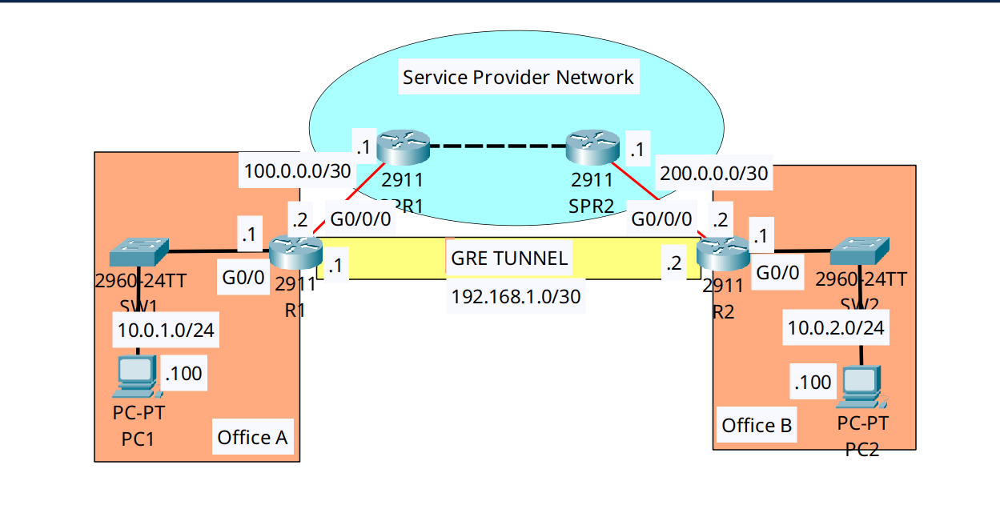

<div align="center">

# 🔄 Site-to-Site VPN Architecture: GRE Tunnels & OSPF Overlay

[](https://cisco.com)
[](https://cisco.com)
[]()
[]()

<p align="center">
  <b>Deploying an enterprise overlay network by encapsulating private LAN traffic inside Generic Routing Encapsulation (GRE) tunnels and dynamically routing across an untrusted ISP backbone.</b>
</p>

</div>

---

## 📌 Executive Summary & Engineering Objective

When enterprise branches need to communicate across a public Service Provider network (the "underlay"), private RFC 1918 subnets cannot be routed directly over the Internet. 

This lab demonstrates the configuration of a **Generic Routing Encapsulation (GRE) Tunnel** (the "overlay"). The edge routers encapsulate the private packet inside a new public IP header, transporting it securely between sites. Furthermore, a dynamic routing protocol (**OSPF**) is enabled across the virtual `Tunnel0` interface, allowing the routers to automatically exchange private LAN routes as if they were directly connected via a dedicated leased line.

*Note: While GRE provides encapsulation, it does not provide encryption. In production, this architecture is typically paired with IPsec (GRE over IPsec).*

---

## 🗺️ Network Topology & Architecture

<div align="center">
  
</div>

---

## 📊 IP Addressing & Overlay/Underlay Schema

| Router | Interface | Network Zone | IP Address | Subnet Mask | Route Domain |
| :--- | :--- | :--- | :--- | :--- | :--- |
| **R1** | `Gig0/0` | Office A LAN | `10.0.1.1` | `255.255.255.0` | Private (OSPF Overlay) |
| **R1** | `Gig0/0/0` | ISP Underlay | `100.0.0.2` | `255.255.255.252` | Public (Static Default) |
| **R1** | `Tunnel0` | **GRE Overlay** | `192.168.1.1` | `255.255.255.252` | Transit (OSPF Overlay) |
| **R2** | `Gig0/0` | Office B LAN | `10.0.2.1` | `255.255.255.0` | Private (OSPF Overlay) |
| **R2** | `Gig0/0/0` | ISP Underlay | `200.0.0.2` | `255.255.255.252` | Public (Static Default) |
| **R2** | `Tunnel0` | **GRE Overlay** | `192.168.1.2` | `255.255.255.252` | Transit (OSPF Overlay) |

---

## 🛠️ Cisco IOS Configuration Highlights

### 🔹 R1: GRE Tunnel Interface Configuration
```ios
R1(config)# interface Tunnel0
! 1. Assign the virtual private IP address to the tunnel
R1(config-if)# ip address 192.168.1.1 255.255.255.252

! 2. Define the public IP underlay endpoints for encapsulation
R1(config-if)# tunnel source GigabitEthernet0/0/0
R1(config-if)# tunnel destination 200.0.0.2

! 3. Lower the MTU to prevent IP fragmentation (24 bytes for GRE + new IP header)
R1(config-if)# mtu 1476
```

### 🔹 R1: Dynamic OSPF Overlay Routing
```ios
! Inject the private LAN and the Tunnel interface into OSPF
R1(config)# router ospf 1
R1(config-router)# network 192.168.1.1 0.0.0.0 area 0
R1(config-router)# network 10.0.1.0 0.0.0.255 area 0
```

---

## 🔍 Verification & Operational Proof

### 1. GRE Tunnel Status & Encapsulation Validation (R1)
```text
R1# show interface Tunnel0
Tunnel0 is up, line protocol is up (connected)
  Hardware is Tunnel
  Internet address is 192.168.1.1/30
  Encapsulation TUNNEL, loopback not set
  Tunnel source 100.0.0.2 (GigabitEthernet0/0/0), destination 200.0.0.2
  Tunnel protocol/transport GRE/IP
  Tunnel transport MTU 1476 bytes
```
*Validation:* The virtual interface is `up/up`. The output confirms that private traffic entering `Tunnel0` is encapsulated using `GRE/IP` and transported across the public `100.0.0.2` -> `200.0.0.2` underlay.

### 2. OSPF Adjacency Through the Tunnel
```text
R1# show ip ospf neighbor
Neighbor ID     Pri   State           Dead Time   Address         Interface
200.0.0.2         0   FULL/  -        00:00:39    192.168.1.2     Tunnel0
```
*Validation:* OSPF successfully established a `FULL` adjacency *through* the logical tunnel interface. R1 sees R2's virtual tunnel IP (`192.168.1.2`) as a direct neighbor.

### 3. Verification of the Private Overlay Route
```text
R1# show ip route
Gateway of last resort is 100.0.0.1 to network 0.0.0.0

     10.0.0.0/8 is variably subnetted, 3 subnets, 2 masks
C       10.0.1.0/24 is directly connected, GigabitEthernet0/0
O       10.0.2.0/24 [110/1001] via 192.168.1.2, 00:03:32, Tunnel0
S*   0.0.0.0/0 [1/0] via 100.0.0.1
```
*Validation:* R1 successfully learned the route to Office B's private LAN (`10.0.2.0/24`) via OSPF `[110]`. The next hop is the tunnel's IP address, bypassing the public internet gateway.

---

## 🧰 NOC Diagnostic & Troubleshooting Cheat Sheet

| Diagnostic Command | Execution Mode | Incident Response Application |
| :--- | :--- | :--- |
| `show interface tunnel 0` | Privileged EXEC (`#`) | Verifies tunnel state, encapsulation type, transport MTU, and endpoint misconfigurations. |
| `ping [destination] source [tunnel_ip]` | Privileged EXEC (`#`) | Tests underlay connectivity. *A GRE tunnel will remain UP if there is a valid route to the tunnel destination, even if the destination is currently unreachable.* |
| `show ip ospf neighbor` | Privileged EXEC (`#`) | Validates that multicast OSPF hello packets are successfully traversing the GRE tunnel. |
| `traceroute [private_ip]` | Privileged EXEC (`#`) | Confirms that traffic to the remote branch takes exactly 1 hop (over the tunnel) instead of bleeding out to the ISP. |

---

## 📦 Included Artifacts

* `site-to-site-gre-tunnel-ospf.pkt` — Packet Tracer overlay simulation.
* `topology.png` — Network topology diagram.
* `r1-config.ios` — Office A Router config containing GRE tunnel and OSPF overlay.
* `r2-config.ios` — Office B Router config containing GRE tunnel and OSPF overlay.
