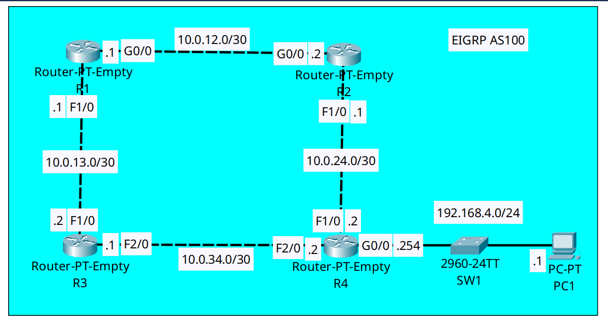

<div align="center">

# 🔄 EIGRP Advanced Architecture: DUAL Feasibility Condition & Unequal-Cost Load Balancing (Variance)

[](https://cisco.com)
[](https://cisco.com)
[]()
[]()

<p align="center">
  <b>Unlocking asymmetric link utilization by validating the DUAL Feasibility Condition and enforcing EIGRP Unequal-Cost Multi-Path (UCMP) load balancing using the variance multiplier.</b>
</p>

</div>

---

## 📌 Executive Summary & Engineering Objective

Most Interior Gateway Protocols (such as OSPF and IS-IS) are strictly limited to **Equal-Cost Multi-Path (ECMP)** routing. If two paths to a destination have different metrics, the sub-optimal path sits completely idle as a dormant backup, stranding expensive bandwidth.

**EIGRP is the only routing protocol capable of Unequal-Cost Load Balancing (UCLB).**

This lab demonstrates the mathematical and operational mechanics of Cisco's **Diffusing Update Algorithm (DUAL)** across a 4-router diamond topology:
1. **Feasibility Condition (FC) Verification:** Proving that a neighbor can only become a **Feasible Successor (FS)** if its Advertised/Reported Distance is strictly lower than the primary route's Feasible Distance ($AD < FD$). This mathematical rule guarantees instantaneous, loop-free backup convergence.
2. **Variance Multiplier Tuning:** By default, EIGRP variance is `1` (ECMP only). Configuring `variance 2` on `R1` allows any valid Feasible Successor path with a total metric up to $2 \times FD$ to be simultaneously installed into the IP Routing Information Base (RIB). Traffic is then distributed proportionally across both GigabitEthernet and FastEthernet paths.

---

## 🗺️ Network Topology & Architecture

<div align="center">
  
</div>

---

## 📊 DUAL Metric & Feasibility Condition Matrix (Destination: `192.168.4.0/24`)

| Path via Neighbor | Egress Interface | Advertised Distance ($AD$) | Total Feasible Distance ($FD$) | Feasibility Condition ($AD < FD_{succ}$)? | Status & Role |
| :--- | :--- | :---: | :---: | :---: | :--- |
| **`10.0.12.2` (R2)** | `Gig0/0` | **`28416`** | **`28672`** | N/A (Best Metric) | 🏆 **Successor** (Primary Route) |
| **`10.0.13.2` (R3)** | `Fa1/0` | **`28416`** | **`30976`** | **`28416 < 28672` (TRUE)** | 🛡️ **Feasible Successor** (Backup) |

### 🧮 The Variance 2 Injection Proof:
* **Successor FD:** `28672`
* **Configured Variance:** `2`
* **Maximum Allowable Metric:** $\text{Variance} \times FD = 2 \times 28672 = \mathbf{57344}$
* **Feasible Successor Metric:** $\mathbf{30976} \le \mathbf{57344}$ $\rightarrow$ **INSTALLED INTO ROUTING TABLE**

---

## 🛠️ Cisco IOS Configuration Highlights

### 🔹 R1: Variance Multiplier & Passive Loopback Hardening
```ios
router eigrp 100
 ! Multiply the Successor FD by 2 to permit unequal-cost load balancing
 variance 2
 ! Suppress unnecessary EIGRP hello multicasts on loopback interfaces
 passive-interface Loopback1
 network 10.0.0.0
 network 1.1.1.1 0.0.0.0
 no auto-summary
```

### 🔹 R4: Gateway Advertisement & Edge LAN Isolation
```ios
router eigrp 100
 ! Isolate user access LAN from receiving EIGRP routing updates
 passive-interface GigabitEthernet0/0
 passive-interface Loopback1
 network 10.0.0.0
 network 192.168.4.0
 network 4.0.0.0
 no auto-summary
```

---

## 🔍 Verification & Operational Proof

### 1. Dual Routes Installed with Asymmetric Metrics (`R1`)
```text
R1# show ip route eigrp
     4.0.0.0/32 is subnetted, 1 subnets
D       4.4.4.4 [90/156416] via 10.0.12.2, 00:06:48, GigabitEthernet0/0
                [90/158720] via 10.0.13.2, 00:06:47, FastEthernet1/0
     192.168.4.0/24 [90/28672] via 10.0.12.2, 00:06:48, GigabitEthernet0/0
                    [90/30976] via 10.0.13.2, 00:06:47, FastEthernet1/0
```
*Validation:* **This is the smoking gun proof of Unequal-Cost Load Balancing.** Two distinct next-hop paths are actively installed in the routing table for `192.168.4.0/24` with different composite metrics (`28672` vs `30976`). Packets are distributed across `Gig0/0` and `Fa1/0` inversely proportional to their metrics.

### 2. Dissecting the DUAL Topology Table (`R1`)
```text
R1# show ip eigrp topology
P 192.168.4.0/24, 2 successors, FD is 28672
         via 10.0.12.2 (28672/28416), GigabitEthernet0/0
         via 10.0.13.2 (30976/28416), FastEthernet1/0
```
*Validation:* 
* The parenthetical values represent `(Total Distance / Advertised Distance)`.
* Because `variance 2` was configured, the topology table reflects **`2 successors`** actively forwarding traffic, even though their underlying link speeds differ.

### 3. EIGRP Dynamic Neighbor Convergence (`R1`)
```text
R1# show ip eigrp neighbors
H   Address         Interface      Hold Uptime    SRTT   RTO   Q   Seq
0   10.0.12.2       Gig0/0         10   00:07:01  40     1000  0   15
1   10.0.13.2       Fa1/0          13   00:07:01  40     1000  0   16
```
*Validation:* Neighbor relationships are healthy with `0` queue count (`Q Cnt`), confirming stable adjacency without packet drop or retransmission loops.

---

## 🧰 NOC Diagnostic & Troubleshooting Cheat Sheet

| Diagnostic Command | Execution Mode | Incident Response Application |
| :--- | :--- | :--- |
| `show ip route eigrp` | Privileged EXEC (`#`) | Verifies active EIGRP routes installed in the RIB. Displays multiple lines per destination if ECMP or UCLB is operational. |
| `show ip eigrp topology` | Privileged EXEC (`#`) | Displays all successors and feasible successors. *If a backup route is missing here, it failed the Feasibility Condition ($AD \ge FD$).* |
| `show ip eigrp topology all-links` | Privileged EXEC (`#`) | Displays ALL known paths, including those that failed the Feasibility Condition. Essential for troubleshooting why a route won't balance. |
| `show ip eigrp neighbors` | Privileged EXEC (`#`) | Verifies neighbor adjacency, uptime, and hold time. A reset hold timer indicates link flapping or MTU/timer mismatch. |

---

## ⚡ Key NOC Takeaway: The "Feasible Successor First" Rule
Junior engineers often mistakenly believe that simply setting a high `variance` value will force EIGRP to balance across any link. 

**This is false:** EIGRP **never** installs a route into the routing table—regardless of the variance multiplier—unless that route is already recognized as a valid **Feasible Successor** in the topology table. The neighbor's Advertised Distance **must** be strictly less than the Successor's Feasible Distance ($AD < FD$). This mathematical invariant prevents routing loops from forming across asymmetric networks.

---

## 📦 Included Artifacts

* `dynamic-routing-eigrp-variance.pkt` — Packet Tracer 4-router diamond simulation.
* `topology.png` — Network topology diagram.
* `r1-config.ios` — Ingress router configuration enforcing `variance 2` and loopback hardening.
* `r4-config.ios` — Egress destination router configuration with passive interface access isolation.
